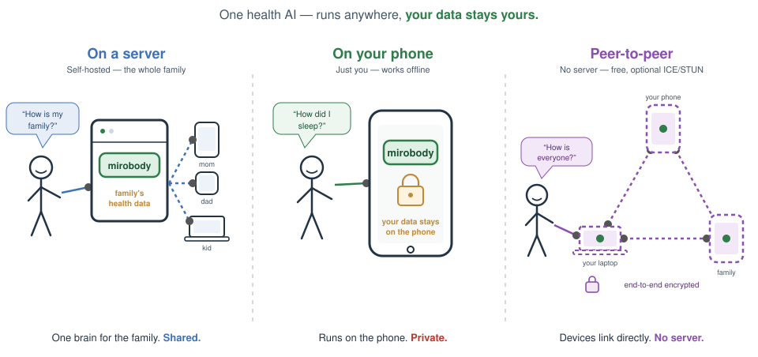
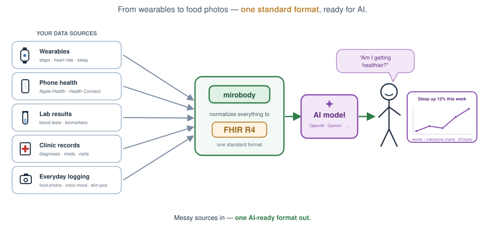
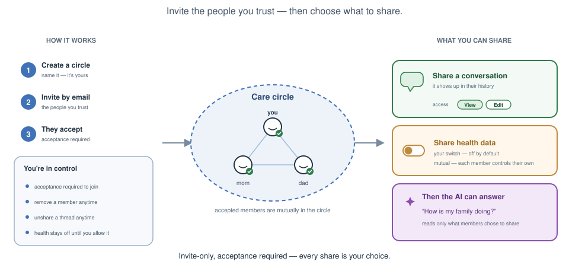
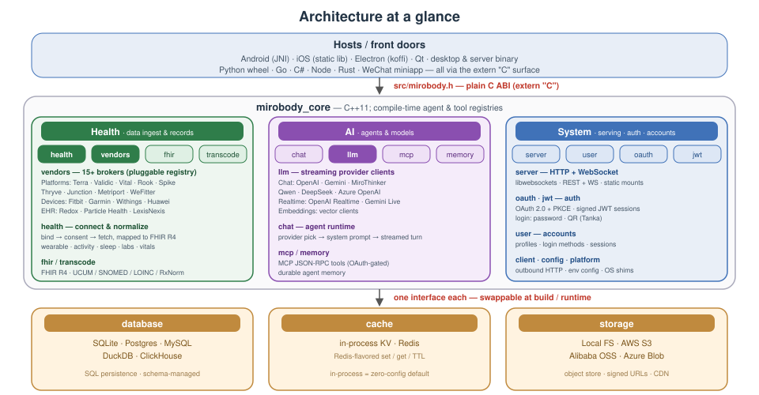

# Mirobody v2

> The C++ port of the [Python mirobody server](https://github.com/thetahealth/mirobody/tree/main), built to run *inside* the
> Android and iOS host app as well as standalone on desktop or a server.
> Because the core runs on-device, **all data can stay on the phone** - it
> never has to leave the device unless you choose to sync it.

**Live demo:** [test.mirobody.ai](https://test.mirobody.ai)

<p align="center">
  
</p>

<p align="center">
  
</p>

<p align="center">
  
</p>

A lightweight C++ server that links personal health data to LLMs - it pulls
wearable, lab, and clinical records from health-data platforms and feeds them to
multiple LLM providers behind one uniform interface. Five pieces make
up the core:

- **LLM clients** ([src/llm/](src/llm/)) - one streaming
  [`llm::Client`](src/llm/client.hpp) per provider (OpenAI, Google Gemini, and
  MiroThinker today), with new providers slotting in behind the same contract.
- **MCP tools** ([src/mcp/](src/mcp/) + [res/mcp_tools/](res/mcp_tools/)) -
  server-side tools exposed over a Model Context Protocol endpoint for clients
  to discover and call.
- **Agents** ([src/chat/](src/chat/) + [res/agents/](res/agents/)) - pick a
  client by provider name, build the system prompt, and stream a turn back.
- **Health platforms** ([src/health/vendor/](src/health/vendor/)) - one
  [`vendor::Vendor`](src/health/vendor/vendor.hpp) per source, brokering wearable,
  lab, and clinical-EHR data behind a common authorize / fetch / webhook contract,
  resolved by id through the [registry](src/health/vendor/registry.hpp). Each
  implements transport against the platform's public API (`fetch` everywhere, plus
  consent/webhook where documented; undocumented operations stay explicit stubs).
  Clients sort into three buckets:
  - `platform/` - 15 B2B aggregators (Terra, Validic, Human API, …)
  - `phone/` - smartphone-vendor stores with a cloud API (Huawei)
  - `device/` - consumer device brands (Fitbit, Withings, Garmin)
  - `ehr/` - direct EHR systems via SMART on FHIR — one generic client for every
    ONC-certified EHR (Epic, Oracle Health/Cerner, athenahealth, …), with a
    directory loader that discovers each tenant's FHIR base URL from public
    Service Base URL lists (ONC Lantern, vendor bundles)
  - on-device-only stores (Apple Health, Samsung Health, Google Health Connect,
    Xiaomi) have no server API and so no client — the host apps read them on-device
    (Health Connect / HMS Health Kit on Android, HealthKit on iOS) and POST FHIR
    Observations instead

  See [src/health/vendor/README.md](src/health/vendor/README.md) for the platform comparison
  the metadata is drawn from, plus the per-vendor implementation-status table.
- **FHIR R4** ([src/fhir/](src/fhir/)) - an embedded RESTful FHIR R4 endpoint plus
  the terminology machinery behind it:
  - uploaded documents are parsed into indicators and values
  - units are normalized to UCUM; indicators mapped to SNOMED CT / LOINC / RxNorm
  - on-device health data the Android / iOS apps read (Health Connect / HMS Health
    Kit / Apple HealthKit) is POSTed to the same write endpoint as `Observation`s
  - the results are served as FHIR resources

  See [src/fhir/README.md](src/fhir/README.md).

Agents and tools both self-register at compile time: drop a `.cpp` in the
matching `res/` directory and rebuild.


On desktop/embedded it runs as a standalone binary serving HTTP + WebSocket over
the network. On Android and iOS the same core ships inside the host app - as a
shared library loaded over JNI on Android, and as a static library linked
through the C API in [src/mirobody.h](src/mirobody.h) on iOS.

That C API is a plain `extern "C"` surface, so any language with a C FFI can
embed the core without going through the HTTP/WebSocket front door - Java
(JNI/JNA/Panama), Go (cgo), C# (P/Invoke), Rust (`extern "C"`), Swift,
Python (ctypes/cffi), and so on.



## Quick start

The default desktop database backend is `POSTGRESQL`, so these install
the Postgres client (`libpq`) alongside the core deps. For other backends,
Fedora/RHEL packages, and full options, see [Building - desktop](#building---desktop).

### Linux

```sh
# Debian / Ubuntu / WSL
sudo apt install build-essential cmake ninja-build pkg-config \
                 libwebsockets-dev libcurl4-openssl-dev libssl-dev \
                 rapidjson-dev libyaml-cpp-dev libhiredis-dev libpq-dev \
                 libjpeg-dev libpng-dev libtiff-dev libwebp-dev
./build.sh          # -> build/mirobody
./mirobody          # reads ./config.yml
```

### macOS

```sh
brew install cmake ninja pkg-config libwebsockets curl openssl@3 \
             rapidjson yaml-cpp hiredis libpq \
             jpeg-turbo libpng libtiff webp
./build.sh          # -> build/mirobody
./mirobody          # reads ./config.yml
```

### Windows

Install Visual Studio with the **Desktop development with C++** workload and the
**C++ CMake tools** component (provides Ninja and a bundled vcpkg). vcpkg pulls
the native deps from [`vcpkg.json`](vcpkg.json) automatically - no manual installs.

```cmd
build.cmd           :: configure + build -> build\mirobody.exe
build\mirobody.exe  :: reads .\config.yml
```

### Webpage

The web client is a static single-page app in [`htdoc/`](htdoc/), served by the
standalone desktop/server binary (the mobile builds have no static surface).
Build it into `res/htdoc`, where `HTTP_ROOT` points by default; `mirobody` then
serves it at `http://localhost:8080`:

```sh
cd htdoc
npm install
npm run build       # -> res/htdoc, served by mirobody at :8080
```

For live-reload development, run the webpack dev server (port 8090) - it proxies
API calls to a `mirobody` backend on :8080:

```sh
npm start
```

The login screen offers email one-time-code sign-in plus whichever social
providers are configured - Google / Apple / X (via Firebase), WeChat, GitHub, and
**Tanka QR-code login** (on by default). Tanka is the one provider with a runtime
`node` dependency: the server self-heals Tanka's request-signer by running
`res/tanka/discover.cjs` at boot and weekly, falling back to a pinned build when
`node` or Tanka is unavailable. See [src/user/README.md](src/user/README.md) for
the flow and the `TANKA_*` keys in [config.example.yml](config.example.yml).

### Android

Native deps come from prebuilt sysroots under `android/prebuilt/<ABI>/`
(`arm64-v8a` only today). Then build the host app, which bundles
`libmirobody.so`:

```sh
cd android
./gradlew assembleRelease
```

See [Building - Android](#building---android) for the prebuilt-sysroot setup.

### iOS

Native deps come from prebuilt sysroots under `ios/prebuilt/<sdk>-<arch>/`.
Build the `arm64` device slice and link it into the SwiftUI host via the C API:

```sh
cmake -S . -B build-ios-arm64 -G Xcode \
    -DCMAKE_TOOLCHAIN_FILE=path/to/ios.toolchain.cmake \
    -DPLATFORM=OS64 -DDEPLOYMENT_TARGET=15.0 \
    -DCMAKE_PREFIX_PATH="$(pwd)/ios/prebuilt/iphoneos-arm64"
cmake --build build-ios-arm64 --config Release
```

See [Building - iOS](#building---ios) for the simulator slice, the xcframework
packaging, and Swift usage.

### Desktop (Electron)

[`electron/`](electron/) wraps the server in an Electron desktop app: the main
process embeds `libmirobody` **in-process** via koffi FFI (the same C API as the
other FFI hosts) and a `BrowserWindow` loads the `htdoc` web client from the
embedded server's loopback port - no separate process, and no `electron-rebuild`
across Electron's Node versions. Build the shared library and the web client
first, then run from the repo root:

```sh
./build-shared.sh                 # -> build-shared/libmirobody.* (build-shared.cmd on Windows)
( cd htdoc && npm run build )     # -> res/htdoc (already built in a fresh checkout)
( cd electron && npm install && npm start )
```

It uses the self-contained SQLite backend, so no external database is needed;
the embedded server runs off the committed [config.example.yml](config.example.yml),
so sign in with the demo credentials it defines (`demo1@mirobody.ai` / `777777`)
and add an LLM key there to enable chat. `npm run dist` packages it with
electron-builder.

See [electron/README.md](electron/README.md) for the `extraResources` packaging
layout, the writable-vs-read-only path handling, and the fixed-port note.

### Desktop (Qt)

[`qt/`](qt/) is a native **Qt Quick (QML)** desktop client - the C++ counterpart
of the web client in `htdoc/`. Unlike Electron, it does **not** embed
`libmirobody`; it is a pure HTTP/SSE API client built on Qt's networking stack,
so it talks to any running `mirobody` backend over the network. It mirrors the
web client's main flow (email-code login, streamed agent/proxy chat, provider
picker, history, settings, ten languages). It is off by default and needs
**Qt 6.5+**:

```sh
cmake -B build-qt -S . -DMIROBODY_BUILD_QT=ON \
      -DCMAKE_PREFIX_PATH=/path/to/Qt/6.x/<compiler>
cmake --build build-qt --target mirobody_qt
```

Launch it, open **⚙ → Backend** to point at a server (default
`http://127.0.0.1:8080`), and sign in with a demo code from
[`config.yml`](config.yml) (e.g. `demo1@mirobody.ai` / `777777`). Because the
target pulls in no `mirobody_core` deps, it can also be built on its own.

See [qt/README.md](qt/README.md) for the architecture, the API mapping, and the
two intentional omissions (social sign-in, KaTeX math).

### Wechat Miniapp

A native WeChat Mini Program client lives in [`miniapp/`](miniapp/) (WXML/WXSS/JS,
no build step). It mirrors the web client: the same `{code, msg, data}` envelope,
bearer-JWT auth, and streamed `/api/chat` agent protocol. Open the folder in
**WeChat DevTools** as a Mini Program project - it runs directly,
no `npm install`:

```
miniapp/
  project.config.json   # set your Mini Program AppID here
  config.js             # backend baseUrl (dev: http://localhost:8080) + language
  pages/login/          # wx.login() -> POST /wechat/verify -> token
  pages/chat/           # provider picker + streamed agent chat
```

Login goes through **`POST /wechat/verify`**: the page hands the `wx.login()`
code to the server, which exchanges it via WeChat's `jscode2session`
(`WECHAT_APPID` / `WECHAT_SECRET` in [`config.yml`](config.yml)) for the user's
openid and mints the same tokens as `/email/verify`.

See [miniapp/README.md](miniapp/README.md) for the full setup, the backend
contract, and the streaming-over-`wx.request` details.

## Dependencies

How each platform sources its native libraries:

| Platform           | Source                                                                                  |
| ------------------ | --------------------------------------------------------------------------------------- |
| Windows            | vcpkg manifest ([`vcpkg.json`](vcpkg.json)) - see "Building - Windows" below.           |
| Linux / WSL / macOS | System package manager (`apt` / `dnf` / `brew`) - see "Building - Linux / WSL / macOS". |
| Android / iOS      | Prebuilt sysroots under `android/prebuilt/<ABI>/` and `ios/prebuilt/<sdk>-<arch>/`.     |

Library list:

| Package                  | Purpose                                                      | License |
| ------------------------ | ------------------------------------------------------------ | ------- |
| libwebsockets            | HTTP + WebSocket server / client                             | MIT |
| libcurl (OpenSSL backend)| Upstream HTTPS requests                                      | MIT/X (curl) |
| OpenSSL                  | TLS for libwebsockets and libcurl                           | Apache-2.0 |
| RapidJSON                | JSON parsing / serialization                                 | MIT |
| yaml-cpp                 | Config file parsing                                          | MIT |
| hiredis                  | Redis protocol client (remote KV / cache backend)            | BSD-3-Clause |
| libjpeg / libpng / libtiff / libwebp | Image decode / encode (image transcoder)        | BSD-3 / zlib / IJG (all permissive) |
| xlnt                     | `.xlsx` reader for the document transcoder (auto-detected; required on Windows via vcpkg, optional elsewhere) | MIT |
| PDFium *(optional)*      | PDF text extraction + page rasterization; enable with `-DMIROBODY_ENABLE_PDF=ON` (prebuilt binary, e.g. bblanchon/pdfium-binaries) | BSD-3-Clause (binaries wrapped MIT) |
| Tesseract *(optional)*   | OCR for scanned PDF pages; enable with `-DMIROBODY_ENABLE_OCR=ON` (implies `-DMIROBODY_ENABLE_PDF=ON`) | Apache-2.0 (+ Leptonica BSD-2-Clause) |
| libxls *(optional)*      | Legacy binary `.xls` reader; enable with `-DMIROBODY_ENABLE_XLS=ON` (no vcpkg port — vendored) | BSD-2-Clause |
| OpenBLAS *(optional)*    | Sets `MIROBODY_HAS_BLAS=1` when `BLAS` is found              | BSD-3-Clause |

All of the above are permissive (no copyleft), so they impose no source-disclosure
obligation on the proprietary mobile hosts the core embeds into. The document-transcoder
deps (xlnt, PDFium, Tesseract/Leptonica, libxls) were license-verified against their
upstream `LICENSE` files; the optional libraries' transitive dependencies should be
re-checked at the point they are actually built (e.g. via each vcpkg port's installed
`copyright` file). Tesseract's `*.traineddata` language files bundled under `res/` are a
separate artifact (Apache-2.0, from `tessdata_fast` / `tessdata_best`).

### Database client libraries

Exactly one of these is linked into `mirobody_core`, picked by
`MIROBODY_DATABASE_BACKEND`. SQLite is the mobile default; `POSTGRESQL`
(the libpq client with the modern `res/sql/pg` schema) is the desktop
default - install only the one(s) you actually plan to build against.

| Package                       | Direct download                                                          |
| ----------------------------- | ------------------------------------------------------------------------ |
| SQLite amalgamation           | https://sqlite.org/download.html                                         |
| PostgreSQL (ships `libpq`)    | https://www.postgresql.org/download/                                     |
| Oracle MySQL Connector/C      | https://dev.mysql.com/downloads/connector/c/                             |
| MariaDB Connector/C (LGPL)    | https://mariadb.com/downloads/connectors/connectors-data-access/c-connector |
| DuckDB C/C++ library          | https://duckdb.org/docs/installation/                                    |

### vcpkg manifest *(Windows only)*

[`vcpkg.json`](vcpkg.json) lists every backend so a fresh Windows checkout
pulls them all; the ones you don't select get compiled by vcpkg and ignored
at link time. To trim install time, drop the unwanted entries from
`vcpkg.json` before configuring - or move them into the parked `$dependencies`
array (vcpkg ignores `$`-prefixed fields), which is how `duckdb` and
`libmysql` are currently kept out of the default build.

If you'd rather not use vcpkg on Windows either, install the client library
directly and point cmake at it via `-DCMAKE_PREFIX_PATH=<install-root>`. The
CMake `find_package` calls currently use vcpkg-style target names, so the
MySQL and DuckDB branches in `CMakeLists.txt` may need a small tweak when
consuming a non-vcpkg install.

## Toolchain

C++11 is the floor. Set via `CMAKE_CXX_STANDARD 11` / `_REQUIRED ON` /
`_EXTENSIONS OFF`; `mirobody_core` exposes `cxx_std_11` as a public
`target_compile_features` so every downstream target inherits the
requirement, and a `static_assert` in
[src/platform/log.hpp](src/platform/log.hpp) catches any consumer that
slips through. MSVC builds add `/W4 /utf-8 /permissive- /Zc:__cplusplus`.

| Compiler    | Minimum                                              |
| ----------- | ---------------------------------------------------- |
| MSVC        | Visual Studio 2015 (2017 / 2019 / 2022 / Preview 18) |
| GCC         | 4.8.1 (Linux / WSL)                                  |
| Clang       | 3.3 (Linux / WSL)                                    |
| Apple Clang | Xcode 5 (iOS / macOS)                                |
| Android NDK | r14                                                  |

### C++11

The code was retreated to C++11 to widen the
set of host environments mirobody can embed into. Features that are post-C++11
are shimmed in [src/compat/cxx11.hpp](src/compat/cxx11.hpp):

- `mirobody::optional<T>` / `mirobody::nullopt` - minimal drop-in for
  `std::optional` using `std::aligned_storage` under the hood.

(The codebase deals in `const std::string&` / `const char*` / `(const void*,
size_t)` directly rather than a `string_view` shim.)

## Database

`mirobody_core` keeps its in-process SQL persistence behind a single `Database`
class, linking exactly one concrete backend at build time:

- **Backends** — `SQLITE` / `DUCKDB` / `POSTGRESQL` / `POSTGRESQL_LEGACY` / `MYSQL` / `CLICKHOUSE`, selected via the `MIROBODY_DATABASE_BACKEND` CMake option.
- **Defaults** — `SQLITE` on mobile, `POSTGRESQL` on desktop / server.
- **One per build** — the backend is chosen at compile time, so call sites stay backend-agnostic.

See [src/database/README.md](src/database/README.md) for the full backend
matrix, build-target defaults, the preprocessor macros each value defines, and
the SQL-portability notes across the five dialects.

## Cache

`mirobody::cache::Cache` is a Redis-flavored key/value store behind one type,
with a pluggable backend:

- **API** — `set` / `get` / `incr` / `decr` / `exists` / `del` / `expiretime` / `prune` / `flushdb` / `dbsize`.
- **Backends** — in-process `MemoryKv` (zero-config default) or a hiredis-backed Redis connection.
- **Uniform** — both expose the same `Cache open() const` shape, so call sites read the same regardless of backend.

See [src/cache/README.md](src/cache/README.md) for the usage example, the
expiration / eviction semantics, and the `MemoryKv` direct-access notes.

## Storage

`mirobody::storage::Storage` is an object-store interface with runtime-selected
backends:

- **API** — `put_object` / `get_object` / `delete_object` / `presigned_url` / `public_url`.
- **Backends** — AWS S3 / S3-compatible, Alibaba Cloud OSS, Azure Blob, and local filesystem. Unlike the SQL `Database` (one backend linked per build), all compile into every build and the caller picks one at runtime from config.
- **User uploads** — `put_user_object` stores bytes under a per-user, content-addressed key (HMAC-hashed user segment and digest, content-type-derived suffix) with a `<key>.meta` metadata sidecar; `list_user_objects` scans a user's prefix back.

See [src/storage/README.md](src/storage/README.md) for the backend table, the
`configured()` / `open()` usage example, the user-object key scheme,
`LocalStorage` setup, the named-OSS getter, and where request signing lives and
is tested.

## Memory

`mirobody::memory::Memory` is a long-term memory interface — `remember` /
`recall` / `forget` — that stores durable facts about a user and recalls the
most relevant ones for a turn, surfaced to agents as the `remember` /
`recall_memory` MCP tools. Every backend compiles in; the caller picks one at
runtime via `MEMORY_PROVIDER`:

- **`local`** *(default)* — facts plus 1024-dim embeddings in the app `Database`, ranked by in-process cosine over the caller's own rows; no extra services, works on every SQL backend.
- **`everos`** — an EverOS-compatible remote memory service.
- **`mem0`** — [Mem0](https://mem0.ai).
- **`zep`** — [Zep](https://getzep.com).

These remote adapters talk to a SOTA memory service over HTTP. It is the
mirobody analog of [EverOS](https://github.com/EverMind-AI/EverOS)'s memory
subsystem.

See [src/memory/README.md](src/memory/README.md) for the backend table, the
`make_memory()` usage example, the local cosine / pgvector-upgrade notes, the
remote-adapter caveats (opaque ids, server-side extraction), the config keys,
and how to add a backend.

## Vendor

`mirobody::vendor::Vendor` is a health-data source interface — `authorize_url` /
`list_providers` / `fetch` / `handle_webhook` / `revoke` — over brokers of
wearable, lab-diagnostic, and clinical-EHR data. Every vendor compiles in; the
caller picks one at runtime by id via `open_vendor()`. The clients live under
[src/health/vendor/](src/health/vendor/) in three buckets:

- **`platform/`** — 15 B2B aggregators (Terra, Validic, Human API, Junction, Metriport, …).
- **`phone/`** — smartphone-vendor stores with a cloud API (Huawei).
- **`device/`** — consumer device brands (Fitbit, Withings, Garmin).
- on-device-only stores (Apple, Samsung, Google Health Connect, Xiaomi) have no client and feed the FHIR endpoint instead.

Alongside real, queryable `VendorInfo` metadata, each vendor implements transport
against the platform's public API: `fetch` everywhere (the vendor's native JSON or
FHIR, per platform), plus consent and webhook operations where the contract is
documented. Per-deployment hosts (self-hosted or contract-gated) require an
explicit `base_url` rather than a guessed one, and operations with no public
contract stay `VendorError` stubs — never fabricated.

See [src/health/vendor/README.md](src/health/vendor/README.md) for the competitive matrix the
metadata is drawn from - positioning, data-source coverage, compliance posture,
and integration style across all 15 platforms - and the implementation-status
table tracking which operations are live per vendor.

## Config

Config is resolved from layered sources, merged per key with higher layers
overriding lower:

- **Precedence** (high → low) — environment variables → `config.yml` → remote config → committed `config.example.yml` template.
- **Local** — copy `config.example.yml` to `config.yml` (git-ignored) and edit that.
- **Remote** — pulled only when `CONFIG_SERVER` / `CONFIG_TOKEN` / `ENV` are all set (`ENV` selects which remote environment to fetch; it doesn't affect local files).
- **Encrypted values** — values beginning with `gAAAA` are Fernet-decrypted on load when `CONFIG_ENCRYPTION_KEY` is set, one key shared across every source.
- **Sub-path mounting** — `HTTP_URI_PREFIX` can mount the whole app under a sub-path.

See [src/config/README.md](src/config/README.md) for the full precedence list,
an example `config.yml`, the URI-prefix (sub-path mounting) details, remote-
config pull, and the encrypted-values derivation.

## Building - desktop

### Windows (MSVC + CMake + Ninja + vcpkg)

#### 1. Install Visual Studio

**Visual Studio 2017 or newer** (2019 / 2022 / Preview 18 all work; 2015 also
compiles but Ninja didn't ship with it, so you'd have to install Ninja
separately). Community edition is fine - download from
[visualstudio.microsoft.com](https://visualstudio.microsoft.com/downloads/).

In the installer, under *Workloads*, tick **Desktop development with C++**.
Then under *Individual components*, also tick **C++ CMake tools for Windows** -
that's the package that drops `ninja.exe` into
`<VS>\Common7\IDE\CommonExtensions\Microsoft\CMake\Ninja\`, which is exactly
where `build.cmd` looks for it. No separate Ninja install is needed.

#### 2. Get vcpkg *(optional)*

Visual Studio's "C++ CMake tools for Windows" component ships its own vcpkg at
`%VS_DIR%\VC\vcpkg`. `vcvarsall.bat` exports `VCPKG_ROOT` pointing at it, and
`build.cmd` will use that by default - **you can skip this step.**

You might still want a standalone clone if you'd like:

- **Independent updates.** Refresh `vcpkg` (and the `builtin-baseline` it
  pins) without waiting for a Visual Studio update - handy when you need a
  port fix that hasn't landed in VS yet.
- **Stable cache across VS upgrades.** A VS update may reset the bundled
  `VC\vcpkg\` directory, including any in-place state. A standalone clone
  isn't touched.
- **One vcpkg shared across machines / IDEs.** Same checkout works from
  CLion, Rider, CI, plain `cmake`, etc. - no need to keep them in sync with a
  specific VS install.

If you want one, clone and bootstrap anywhere on disk:

```cmd
git clone https://github.com/microsoft/vcpkg.git C:\Tools\vcpkg
C:\Tools\vcpkg\bootstrap-vcpkg.bat
```

Pick any path you like in place of `C:\Tools\vcpkg`. Then set `VCPKG_ROOT` in
step 3 below so the script picks your checkout over VS's bundled one.

**Slow GitHub?** The clone above pulls vcpkg's full history (~300k objects). On
a throttled connection, a shallow clone from a mirror is far quicker. Because
`--depth 1` only contains the tip commit (not the `builtin-baseline` pinned in
`vcpkg.json`), re-pin the baseline to that commit afterwards - this repo has no
version constraints, so the single commit is enough:

```cmd
git clone --depth 1 https://gitclone.com/github.com/microsoft/vcpkg.git C:\Tools\vcpkg
C:\Tools\vcpkg\bootstrap-vcpkg.bat
cd /d {your_project_directory}
C:\Tools\vcpkg\vcpkg.exe x-update-baseline
```

#### 3. Set environment variables

Target **arch and backend are command-line tokens** to `build.cmd` (see step 4),
not environment variables. The variables below only point `build.cmd` at your
toolchain; all are optional. Set them once in your user environment (PowerShell
`[Environment]::SetEnvironmentVariable`, `setx` from cmd, or *System Properties
-> Environment Variables*) and every new shell picks them up:

| Variable     | Required? | Points at                                        | Example                                                                                  |
| ------------ | --------- | ------------------------------------------------ | ---------------------------------------------------------------------------------------- |
| `VS_DIR`     | optional  | Visual Studio install root (contains `VC\...`)     | `C:\Program Files\Microsoft Visual Studio\18\Community` - script default if unset.       |
| `VCPKG_ROOT` | optional  | vcpkg checkout (contains `scripts\buildsystems`) | `C:\Tools\vcpkg` - only set if you went with step 2. Otherwise vcvars points at VS-bundled.    |
| `NINJA`      | optional  | `ninja.exe` path                                 | `C:\Tools\ninja\ninja.exe` - defaults to the copy under `%VS_DIR%\Common7\IDE\...\Ninja\`. |
| `MIROBODY_VCPKG_CACHE` | optional | shared vcpkg binary cache dir          | `\\nas\team\vcpkg-cache` - reused across machines and build dirs (created if missing); lets a fresh build pull prebuilt packages instead of compiling from source. |

```cmd
:: Only set the ones whose defaults don't match your install.
setx VS_DIR "C:\Program Files\Microsoft Visual Studio\18\Community"
setx VCPKG_ROOT C:\Tools\vcpkg                :: only if you cloned your own vcpkg
setx NINJA C:\Tools\ninja\ninja.exe           :: only if you installed Ninja separately
setx MIROBODY_VCPKG_CACHE \\nas\vcpkg-cache   :: only to share a vcpkg binary cache
```

Override these via the environment rather than editing the script. To switch
*back* to VS-bundled vcpkg after `setx`-ing `VCPKG_ROOT`, remove the variable
(an empty `setx` only blanks it; this fully unsets it):

```powershell
[Environment]::SetEnvironmentVariable("VCPKG_ROOT", $null, "User")
```

#### 4. Build

```cmd
build.cmd              :: host arch + POSTGRESQL        -> build\
build.cmd legacy       :: POSTGRESQL_LEGACY             -> build_legacy\
build.cmd sqlite       :: SQLITE                        -> build_sqlite\
build.cmd legacy clean :: reconfigure that dir from scratch
build.cmd -h           :: full token list (arch / backend / clean)
```

Backend token: `pg` / `postgresql`, `legacy` / `pg_legacy`, `mysql`, `sqlite`,
`duckdb`, `ck` / `clickhouse` (omit for the `POSTGRESQL` default). Arch
token: `amd64` (default, the host) or `arm64` / `x86` to cross-compile. Each
arch+backend combo lives in its own `build[_<arch>][_<backend>]` directory and
they all share one `vcpkg_installed`, so you can keep several configured at once.

Output: `build\mirobody.exe` (or `build_legacy\mirobody.exe`, … per backend).

### Linux / WSL / macOS

Install the dependencies from your system package manager - vcpkg is only used
on Windows. CMake's `find_package` picks them up directly.

```sh
# Debian / Ubuntu / WSL: core dependencies (always needed)
sudo apt install build-essential cmake ninja-build pkg-config \
                 libwebsockets-dev libcurl4-openssl-dev libssl-dev \
                 rapidjson-dev libyaml-cpp-dev libhiredis-dev \
                 libjpeg-dev libpng-dev libtiff-dev libwebp-dev

# Fedora / RHEL: core dependencies
sudo dnf install gcc-c++ cmake ninja-build pkgconf-pkg-config \
                 libwebsockets-devel libcurl-devel openssl-devel \
                 rapidjson-devel yaml-cpp-devel hiredis-devel \
                 libjpeg-turbo-devel libpng-devel libtiff-devel libwebp-devel

# macOS (Homebrew): core dependencies
brew install cmake ninja pkg-config libwebsockets curl openssl@3 \
             rapidjson yaml-cpp hiredis \
             jpeg-turbo libpng libtiff webp
```

The image codecs above also cover the document transcoder's only always-on
external dep path (CSV is built-in, no library). The document transcoder's other
formats need extra libraries, none of which break the build when absent - the
matching format just reports "not built" at runtime:

```sh
# .xlsx (xlnt): NOT packaged for Debian/Ubuntu/Fedora/Homebrew - build from source
# (https://github.com/xlnt-community/xlnt). CMake auto-detects it; without it the
# build still succeeds and .xlsx is disabled (CSV/PDF unaffected).

# OCR for scanned PDFs (-DMIROBODY_ENABLE_OCR=ON, implies -DMIROBODY_ENABLE_PDF=ON):
sudo apt install tesseract-ocr libtesseract-dev libleptonica-dev tesseract-ocr-eng  # Debian / Ubuntu / WSL
sudo dnf install tesseract tesseract-devel leptonica-devel tesseract-langpack-eng   # Fedora / RHEL
brew install tesseract                                                              # macOS (bundles leptonica + eng data)

# PDF (-DMIROBODY_ENABLE_PDF=ON): PDFium is not packaged anywhere - download a
# prebuilt no-V8 release (https://github.com/bblanchon/pdfium-binaries) and point
# -DCMAKE_PREFIX_PATH at it.
# Legacy .xls (-DMIROBODY_ENABLE_XLS=ON): libxls has no package - vendor it.
```

Then install **one** database client library matching the backend you
plan to build against (PostgreSQL is the desktop default; SQLite isn't a
desktop option; see the [Database backends](src/database/README.md) doc for the
full list):

```sh
# PostgreSQL
sudo apt install libpq-dev                        # Debian / Ubuntu / WSL
sudo dnf install libpq-devel                      # Fedora / RHEL
brew install libpq                                # macOS

# MySQL (or libmysqlclient-dev / mysql-devel / mysql-client for Oracle MySQL)
sudo apt install libmariadb-dev
sudo dnf install mariadb-connector-c-devel
brew install mariadb-connector-c

# DuckDB: download a release from https://duckdb.org/docs/installation/
# ClickHouse: stub backend today; no client library to install yet
```

Then build via the wrapper -- the backend is a command-line token (no env var),
passed in any order with `clean`:

```sh
./build.sh             # host arch + POSTGRESQL        -> build/
./build.sh legacy      # POSTGRESQL_LEGACY             -> build_legacy/
./build.sh sqlite      # SQLITE                        -> build_sqlite/
./build.sh legacy clean # reconfigure that dir from scratch
./build.sh -h          # full token list
```

Tokens: `pg` / `postgresql`, `legacy` / `pg_legacy`, `mysql`, `sqlite`, `duckdb`,
`ck` / `clickhouse` (omit for the `POSTGRESQL` default). Each backend
builds into its own `build[_<backend>]` directory, so several can coexist;
`build.sh` builds natively for the host arch.

Or invoke CMake directly if you prefer:

```sh
cmake -S . -B build -G Ninja -DCMAKE_BUILD_TYPE=Release -DMIROBODY_DATABASE_BACKEND=POSTGRESQL
cmake --build build
```

Output: `build/mirobody` (or `build_legacy/mirobody`, … per backend).

### Runtime

```sh
./mirobody                              # reads ./config.yml by default; override with --config <path> or MIROBODY_CONFIG
./mirobody --help                       # also: -h, /?
```

`SIGINT` / `SIGTERM` (or Ctrl-C / Ctrl-Break on Windows) trigger a graceful
shutdown.

## Building - Android

The Android project lives under [android/](android/) and pulls the same
`CMakeLists.txt` via `externalNativeBuild`. It builds the `mirobody` target as a
shared library (`libmirobody.so`) loaded by the Kotlin host app over JNI.

Today the JNI entry point just starts the embedded HTTP + WebSocket server on
loopback and the Kotlin app talks to it over `127.0.0.1`. The plan is to grow
`platform/android_jni.cpp` to call directly into `mirobody_core` (chat,
realtime, etc.) so the Kotlin side never opens a socket - same direction as
iOS below.

Currently the build only targets `arm64-v8a`. The native dependencies
(libwebsockets, libcurl, OpenSSL, yaml-cpp, OpenBLAS) are expected as prebuilt
sysroots under `android/prebuilt/<ABI>/`; `CMAKE_PREFIX_PATH` is wired up in
[android/app/build.gradle.kts](android/app/build.gradle.kts). Producing those
prebuilts is out of scope for this README.

```sh
cd android
./gradlew assembleRelease
```

## Building - iOS

The iOS target builds `libmirobody.a` (plus the transitive `libmirobody_core.a`)
exposing the C API in [src/mirobody.h](src/mirobody.h). A Swift or Objective-C
host links those archives and the prebuilt third-party dependencies, then calls
`mirobody_start` / `mirobody_stop` directly.

Same prebuilt-sysroot situation as Android: libwebsockets, libcurl, OpenSSL,
yaml-cpp, RapidJSON (header-only) must be cross-compiled for iOS ahead of time.
Drop them under `ios/prebuilt/<sdk>-<arch>/` (e.g. `iphoneos-arm64/`,
`iphonesimulator-arm64/`) and point `CMAKE_PREFIX_PATH` at the matching path
per configure.

Use the standard iOS CMake toolchain (e.g.
[leetal/ios-cmake](https://github.com/leetal/ios-cmake)):

```sh
# device slice
cmake -S . -B build-ios-arm64 \
    -G Xcode \
    -DCMAKE_TOOLCHAIN_FILE=path/to/ios.toolchain.cmake \
    -DPLATFORM=OS64 \
    -DDEPLOYMENT_TARGET=15.0 \
    -DCMAKE_PREFIX_PATH="$(pwd)/ios/prebuilt/iphoneos-arm64"
cmake --build build-ios-arm64 --config Release

# simulator slice
cmake -S . -B build-ios-simarm64 \
    -G Xcode \
    -DCMAKE_TOOLCHAIN_FILE=path/to/ios.toolchain.cmake \
    -DPLATFORM=SIMULATORARM64 \
    -DDEPLOYMENT_TARGET=15.0 \
    -DCMAKE_PREFIX_PATH="$(pwd)/ios/prebuilt/iphonesimulator-arm64"
cmake --build build-ios-simarm64 --config Release
```

Bundle the slices into an xcframework that Xcode and SwiftPM can both consume:

```sh
xcodebuild -create-xcframework \
    -library build-ios-arm64/Release-iphoneos/libmirobody.a \
    -library build-ios-simarm64/Release-iphonesimulator/libmirobody.a \
    -output mirobody.xcframework
```

Only `arm64` slices are built - 32-bit and `x86_64`-simulator are intentionally
skipped (no supported iOS hardware needs them).

### Consuming from Swift

Add [src/mirobody.h](src/mirobody.h) to your Xcode bridging header:

```objc
#include "mirobody.h"
```

Then from Swift, on a `127.0.0.1` loopback today:

```swift
let handle = mirobody_start("/path/to/config.yml", nil)
defer { mirobody_stop(handle) }

// The listen port and LLM keys come from the config (HTTP_PORT / OPENAI_API_KEY
// / GOOGLE_API_KEY); read the bound port back from the handle.
let port = mirobody_listen_port(handle)
print("mirobody on 127.0.0.1:\(port)")
```

Loopback only - the bridge force-rewrites `0.0.0.0` to `127.0.0.1` so the host
app doesn't trigger iOS's local-network privacy prompt. When the HTTP/WS surface
is later replaced with direct C/C++ entry points, extend `mirobody.h` with the
new functions and the iOS host calls them the same way.

### iOS host app

A full SwiftUI host app - the iOS counterpart to [`android/`](android) - lives
under [`ios/`](ios). It builds and runs as a pure client (no native artifacts
required), and embeds `mirobody.xcframework` via the C API above once you build it.
See [ios/README.md](ios/README.md) for the `xcodegen generate` build steps,
embedding instructions, and the Google-sign-in setup.

## Building - Python wheel

`mirobody._mirobody` is a CPython extension (a pybind11 module wrapping
`mirobody::Server`) packaged into a `.whl` by scikit-build-core. It exposes a
`Server` class - start/stop the embedded server in-process from Python:

```python
import mirobody
with mirobody.Server(listen_port=8080, openai_api_key="sk-...") as srv:
    print("listening on", srv.listen_port())
```

Build it with [build-python.cmd](build-python.cmd) (Windows) /
[build-python.sh](build-python.sh) (Linux / macOS). The build uses the
`*-windows-static-md` vcpkg triplet so the native deps are linked into the
`.pyd` and the wheel is self-contained - `import mirobody` needs no loose DLLs.
Full details, gotchas, and `pip` invocations are in [python/README.md](python/README.md).

## Embedding - C-ABI shared library (Java, Go, C#, Node, Rust)

Beyond the platform bridges (Android JNI, iOS static lib) and the Python wheel,
the same [src/mirobody.h](src/mirobody.h) C API is built as a standalone shared
library, **`libmirobody`** (`mirobody.dll` / `libmirobody.so` / `.dylib`), that
any language with an FFI loads and drives:

```c
mirobody_server_t* mirobody_start(config_path, data_dir);   // keys + port from config
void mirobody_stop(mirobody_server_t*);
int  mirobody_is_running(mirobody_server_t*);
int  mirobody_listen_port(mirobody_server_t*);
const char* mirobody_get_providers(void);                                    // "Agent/model" pairs
int  mirobody_chat(provider, message, user_id, on_event, user_data);         // serverless LLM + MCP
```

Build it with [build-shared.cmd](build-shared.cmd) / [build-shared.sh](build-shared.sh).
On Windows it defaults to the fully-static `x64-windows-static` triplet (`/MT`),
so the artifact depends only on system DLLs - no vcpkg DLLs and, importantly, no
`vcruntime`/`ucrtbase`, which is what lets it load cleanly into a JVM (whose
bundled CRT otherwise shadows the system one). When `JAVA_HOME` is set it also
builds **`mirobody_jni`**, a JNI shim for the desktop JVM
([src/platform/jni_bridge.cpp](src/platform/jni_bridge.cpp), the same
`ai.thetahealth.mirobody.NativeBridge` class as Android).

Runnable, verified bindings and the full writeup live under
[bindings/](bindings/) - see [bindings/README.md](bindings/README.md):

| Language  | Binding                            | Mechanism                         |
| --------- | ---------------------------------- | --------------------------------- |
| Go        | [bindings/go](bindings/go)         | `syscall.NewLazyDLL` (POSIX: cgo) |
| C# / .NET | [bindings/csharp](bindings/csharp) | P/Invoke (`[DllImport]`)          |
| Node.js   | [bindings/node](bindings/node)     | koffi FFI                         |
| Rust      | [bindings/rust](bindings/rust)     | `extern "C"` + `build.rs`         |
| Java      | [bindings/java](bindings/java)     | JNI shim, or Panama FFM           |

## HTTP API

| Method | Path          | Purpose                                              |
| ------ | ------------- | ---------------------------------------------------- |
| GET    | `/api/health` | Liveness probe - returns `ok`.                       |
| POST   | `/api/chat`    | Streams a chat response over SSE - runs the named agent, or (with no `agent` field) proxies the body to OpenAI `/v1/chat/completions`. Rate-limited per user (`CHAT_RATE_MAX` / `CHAT_RATE_WINDOW_SEC`; the shipped `config.example.yml` caps it at 5 turns / 60s, `0` disables). |

Paths are shown at the root; when [`HTTP_URI_PREFIX`](src/config/README.md#uri-prefix-sub-path-mounting)
is set they are served under it (e.g. `/mirobody/api/health`).

Errors come back as JSON:

```json
{ "code": -1, "msg": "..." }
```

## WebSocket routes

| Method | Path         | Purpose                                                                |
| ------ | ------------ | ---------------------------------------------------------------------- |
| GET    | `/api/chat`  | Live realtime bridge. JWT-guarded upgrade (bearer header or `?token=`); each inbound JSON frame (`{provider, system?, messages[]\|question}`) runs the matching realtime client (OpenAI Realtime / Gemini Live) and streams its events back as JSON frames, ending with `{"type":"end"}`. Shares the path with the `POST /api/chat` SSE route above. |

As with the HTTP routes, this is served under
[`HTTP_URI_PREFIX`](src/config/README.md#uri-prefix-sub-path-mounting) when it is set.

## MCP

A [Model Context Protocol](https://modelcontextprotocol.io) JSON-RPC 2.0
endpoint lets MCP clients discover and invoke server-side tools. The service
([src/mcp/service.hpp](src/mcp/service.hpp)) owns the route and dispatches the
standard methods (`initialize`, `tools/list`, `tools/call`, `ping`) to a
compile-time tool registry.

| Method | Path             | Purpose                                                      |
| ------ | ---------------- | ------------------------------------------------------------ |
| POST   | `/mcp`           | JSON-RPC endpoint; authenticate with a bearer JWT.           |
| POST   | `/mcp/{secret}`  | Same endpoint, authenticated by a personal-MCP secret in the URL - for clients that can't send a bearer token. |
| POST   | `/personal/mcp`  | Mint (or reuse) the caller's personal-MCP secret URL.        |

Discovery (`initialize` / `tools/list`) is unauthenticated; tools flagged
`auth` resolve the caller's identity from the bearer JWT or the personal-MCP
secret before running. An auth-flagged call with no valid token returns
`401` with a `WWW-Authenticate: Bearer resource_metadata="…"` header, which
points the client at the OAuth 2.0 authorization server below so it can obtain a
token. As with the other routes, paths are served under
[`HTTP_URI_PREFIX`](src/config/README.md#uri-prefix-sub-path-mounting) when set.

**Adding a tool.** Discovery is compile-time, not runtime: every file under
[res/mcp_tools/](res/mcp_tools/) is globbed into the build and self-registers
via a `MIROBODY_REGISTER_TOOL(...)` line. A tool declares its parameters in a
small table (C++11 has no signature reflection); the registry expands that into
the MCP `inputSchema` and the OpenAI / Gemini function-descriptor variants. Drop
a new `.cpp` in that directory, rebuild, and the tool is live - see
[res/mcp_tools/echo.cpp](res/mcp_tools/echo.cpp) for the smallest example and
[src/mcp/tool.hpp](src/mcp/tool.hpp) for the registry API.

## OAuth 2.0

An embedded OAuth 2.0 **authorization server** lets MCP clients (and any standard
OAuth client) obtain access tokens through the browser **authorization-code +
PKCE** flow, rather than a human pasting a bearer token. It issues the same
`mb_oauth` JWTs the MCP endpoint already verifies; end-user login and consent
reuse the existing web client.

| Method | Path                                        | Purpose                                   |
| ------ | ------------------------------------------- | ----------------------------------------- |
| GET    | `/.well-known/oauth-protected-resource`     | RFC 9728 resource metadata (root).        |
| GET    | `/.well-known/oauth-authorization-server`   | RFC 8414 server metadata (root).          |
| GET    | `/.well-known/openid-configuration`         | OIDC-discovery compatibility alias (same 8414 body). |
| GET    | `/.well-known/jwks.json`                    | Public JWKS for third-party token validators (RS256 only). |
| POST   | `/oauth/register`                           | RFC 7591 dynamic client registration.     |
| GET    | `/oauth/authorize`                          | Authorization endpoint → web consent.     |
| POST   | `/oauth/token`                              | `authorization_code` + `refresh_token`.   |
| POST   | `/oauth/revoke`                             | RFC 7009 revocation (best-effort).        |

The discovery documents are served at the host root (unaffected by
`HTTP_URI_PREFIX`); the endpoints they advertise carry the prefix. State
(registered clients, single-use codes) lives in the cache; refresh tokens are
stateless JWTs. Tokens are signed HS256 by default (`JWT_KEY`); set
`JWT_PRIVATE_KEY` to sign RS256 and publish a JWKS so third-party resource
servers can verify them without the secret. All keys are optional with working
defaults — see the `OAUTH_*` / `JWT_*` keys in [config.yml](config.yml) and
[src/oauth/README.md](src/oauth/README.md) for the flow, security model, and
configuration.

## FHIR

An embedded **RESTful FHIR R4** endpoint ([src/fhir/rest.hpp](src/fhir/rest.hpp))
serves health records as generic, validated FHIR JSON. The wider goal: an
uploaded document (lab report, discharge summary, …) is parsed into indicators
and values, the units are normalized to canonical UCUM, the indicators are
mapped to **SNOMED CT / LOINC / RxNorm** codes, and the results are
materialized as FHIR resources here. It is the C++ port of the runtime half of
the Python `mirobody.indicator` package (the offline artifact builders stay in
Python; the core only consumes their output).

| Method | Path                  | Purpose                                                  |
| ------ | --------------------- | -------------------------------------------------------- |
| GET    | `/fhir/metadata`      | CapabilityStatement (public discovery).                  |
| POST   | `/fhir`               | batch / transaction Bundle.                              |
| GET    | `/fhir/{type}`        | search → `searchset` Bundle (`_id` / `_count` / `_offset`). |
| POST   | `/fhir/{type}`        | create (server-assigned id) → 201.                       |
| GET    | `/fhir/{type}/{id}`   | read → 200 / 404 / 410 (deleted).                        |
| PUT    | `/fhir/{type}/{id}`   | update or create-with-id → 200 / 201.                    |
| DELETE | `/fhir/{type}/{id}`   | delete (idempotent) → 204.                               |

Bodies are `application/fhir+json`; errors come back as an `OperationOutcome`.
Resource routes require a bearer JWT and are scoped to the authenticated user;
`GET /fhir/metadata` is public. Resources are persisted as generic JSON in a
`fhir_resources` table via `database::Database`, with the server injecting `id`
and `meta` (`versionId` / `lastUpdated`). As with the other routes, paths are
served under [`HTTP_URI_PREFIX`](src/config/README.md#uri-prefix-sub-path-mounting)
when set.

**Status.** Unit normalization and the REST server are built; the terminology
resolver (indicator → code) and the document → FHIR pipeline are the next
milestones. See [src/fhir/README.md](src/fhir/README.md) for the phase table,
the generic-resource model, validation rules, and current limitations.

Reads and writes may target another user's records via `?subject=<member>` —
an opaque care-circle member handle, never a raw user id — when a
[care circle](#care-circles) authorizes it; without it they stay scoped to the
authenticated user.

## Care circles

A **care circle** layers opt-in sharing on top of the otherwise single-user core
— it's whoever you trust with your health (family, a partner, a caregiver). Two
things can be shared, each checked at the read/write path so no other table is
rescoped:

- **Conversations** — grant a fellow member view/edit access to one chat thread; it then appears in their history.
- **Health data** — a per-member, per-circle switch (off / view / edit) that lets accepted members read — or read+write — your FHIR records, so the AI can answer "how is my family doing?".

### Privacy — what the assistant can and can't reach

The view/edit switch governs **two separate planes**, and they are deliberately
asymmetric:

- **FHIR REST** (`?subject=<member>`) honors the full switch: `view` reads,
  `edit` reads **and writes** the sharer's records. This is the programmatic
  data plane (apps, integrations).
- **The AI assistant is read-only, always.** When you pick a member in the chat
  composer's "currently for" selector and ask on their behalf, exactly **one**
  tool — `family_health` — reads their data, and only with `view`-or-higher
  access. Even if they granted you `edit`, the assistant **never writes** to
  their records, memory, files, or chat history. `edit` matters only on the FHIR
  REST plane above.

Every other tool stays scoped to **you**, the signed-in caller, and never reads
or writes the subject's data:

| Tool | Acts on the "currently for" subject? |
| ---- | ------------------------------------ |
| `family_health` | **Yes** — read-only, gated by `view`+ health access |
| `whoami` | No — only flags that a subject is in focus (no id/data) |
| `list_files`, `read_file` | No — your uploads only |
| `recall_memory`, `remember` | No — your long-term memory only |
| `summarize_conversation` | No — your own current conversation only |
| `render_chart`, `echo` | No — touch no user data |

In other words, asking the assistant about a family member can only ever **read**
their health observations, and nothing the assistant does on their behalf can
modify their data or expose their files, memories, or conversations to you. See
[src/chat/README.md](src/chat/README.md) for the threading details
(`UserInfo::subject_user_id`).

A circle is a **group**: any two *accepted* members are mutually in it. Roles are
**Member / Maintainer / Owner** (maintainers and owners are admins who invite &
remove; owners also rename, delete, and change roles). Invites go out by email
and require acceptance.

| Method | Path | Purpose |
| ------ | ---- | ------- |
| POST | `/api/circle/create` \| `/rename` \| `/delete` | manage circles you own |
| POST | `/api/circle/invite` \| `/accept` \| `/decline` \| `/remove` | membership (invite by email, acceptance required) |
| GET\|POST | `/api/circle/members` | every circle you belong to, with your role + health level |
| POST | `/api/circle/role` \| `/nickname` \| `/health-sharing` | per-member role, label, and your own sharing level |
| POST | `/api/conversation/share` \| `/unshare`; GET `/api/conversation/shares` | share a conversation with co-members |

Cross-user references never expose the internal `users` primary key: members are
addressed by an opaque `member` handle (a `care_circle_members` row id) that the
server resolves back to a user with an access check, and the caller's own id only
ever comes from the JWT. Growth is bounded by configurable caps — the shipped
`config.example.yml` allows **5 circles per user** (`CIRCLE_MAX_PER_USER`) and
**5 members per circle** (`CIRCLE_MAX_MEMBERS`), with `0` disabling either.

Modern backends only — the schema lives under `res/sql/{pg,mysql,sqlite}` and the
legacy backend has no care-circle feature. See
[src/circle/README.md](src/circle/README.md) for the group model, the
role/permission matrix, the opaque-handle scheme, the limits, the health-access
seam (`?subject=` cross-user FHIR read/write via `circle::resolve_health_subject`),
and the full route list.

## Debug tools

The desktop build produces a small family of standalone CLIs under `cli/` that
bypass the embedded HTTP/WS server - the LLM debuggers (`mirothinker`,
`openai_chat`, `openai_responses`, `gemini`) each wrap one client in
[src/llm/](src/llm/), `aws_s3` / `aliyun_oss` drive the storage backends, and
`image` / `document` exercise the [src/transcode/](src/transcode/) transcoders
(image-for-vision compliance, and PDF/Excel/CSV → Markdown + image parts), and
`fhir` runs unit normalization (`fhir normalize "<5.6 mg/dL"`) and mints a
bearer JWT for the FHIR routes (`fhir token <user_id> --config <yaml>`), and
`jwt_keygen` generates an RSA keypair for RS256 JWT signing / JWKS publishing
(`jwt_keygen >> config.local.yaml`). Handy for poking at request parameters,
wire-format quirks, or bucket connectivity without rebuilding the server. Toggle
with `-DMIROBODY_BUILD_TOOLS=OFF`.

See [cli/README.md](cli/README.md) for the shared CLI UX, the per-binary
endpoint/credential table, YAML config keys, Gemini-path notes, and the storage
CLI command set.

## Compliance — HIPAA & GDPR

Mirobody is built privacy-first: because the core runs on-device or self-hosted,
**personal health data never has to leave your device or your infrastructure**.
That architecture is the foundation for deploying in a HIPAA- or GDPR-compatible
way — the software gives you the controls, while the deployer remains the covered
entity / data controller responsible for the final compliance posture.

- **Keep PHI in-house.** On the phone (SQLite, offline) or self-hosted
  (PostgreSQL + local or regional object storage), no health record is sent to a
  third party unless you turn on an outbound integration. Care-circle sharing is
  opt-in and off by default, and the AI assistant is **read-only** over another
  member's data (see [Care circles](#care-circles)).

- **HIPAA — choose a BAA-covered LLM.** The one place PHI can leave is the LLM
  call. The public AI Studio / OpenAI-direct endpoints are not covered by a
  Business Associate Agreement, so for PHI route the same models through their
  BAA-eligible enterprise surfaces — both already supported:
  - **Google Gemini via Vertex AI** — set `GOOGLE_GENAI_USE_VERTEXAI=1` with
    `GCP_PROJECT` / `VERTEX_LOCATION` and an OAuth access token; calls go to
    Google Cloud (covered by Google's BAA) instead of AI Studio.
  - **OpenAI GPT via Azure OpenAI** — set `AZURE_OPENAI_ENDPOINT` (the client
    auto-flips into Azure mode) with the deployment and key; calls run inside
    your own Azure resource (covered by Microsoft's BAA).

  See the `VERTEX_*` and `AZURE_OPENAI_*` keys in
  [config.example.yml](config.example.yml).

- **GDPR — data residency & sovereign clouds.** Self-host in your region and pin
  every outbound dependency to it: `VERTEX_LOCATION` / `VERTEX_BASE_URL` for the
  Gemini region, the Azure resource region for GPT, the object-storage region per
  backend (see [Storage](#storage)), and `AZURE_BLOB_ENDPOINT_SUFFIX` for
  sovereign clouds. The single-user core keeps records scoped per user, so
  subject data stays locatable for access and erasure requests.

## Layout

```
src/                    # C++ core
  mirobody.h            # public C ABI (extern "C") — the embedding surface
  main.cpp              # standalone server entry point
  server/               # HTTP + WebSocket routing on libwebsockets
  chat/                 # agents: provider selection, system prompt, streamed turns
  llm/                  # streaming LLM clients (OpenAI, Gemini, MiroThinker; chat / realtime / embeddings)
  mcp/                  # MCP JSON-RPC endpoint + compile-time tool registry
  memory/               # memory::Memory: long-term facts (local embeddings or Mem0 / Zep / EverOS)
  fhir/                 # RESTful FHIR R4 endpoint + unit normalization + terminology
  health/               # health-data layer: account linking, EHR connect, vendor service
    vendor/             # vendor::Vendor — one client per platform (platform/ phone/ device/ ehr/)
  database/             # database::Database: SQL backends (Postgres / SQLite / DuckDB / MySQL / ClickHouse)
  cache/                # cache::Cache facade (in-process KV or Redis)
  storage/              # storage::Storage: S3 / OSS / Azure Blob / local-filesystem backends
  user/                 # user domain: email + social sign-in (incl. Tanka QR), token issuance
  circle/               # care circles: social graph + conversation / health-data sharing
  jwt/                  # JWT issue/verify (HS256 / RS256) + Google / Apple / Firebase ID-token validators
  oauth/                # OAuth 2.0 authorization server (authorization-code + PKCE)
  config/               # Config schema + loader (YAML + Fernet, env fallback)
  transcode/            # upload transcoders: image (vision compliance) + document (PDF/Excel/CSV)
  client/               # libcurl / libwebsockets client wrappers
  compat/               # post-C++11 polyfills (optional)
  platform/             # logging + JNI / C-ABI / pybind11 entry points
cli/                    # standalone per-subsystem debug binaries
res/                    # bundled resources: agents, MCP tools, SQL migrations
tests/                  # C++ unit tests (build/tests/mirobody_tests)
android/                # Gradle project that builds the Android host app
ios/                    # SwiftUI host app (embeds mirobody.xcframework)
electron/               # Electron desktop app (embeds libmirobody via koffi FFI)
qt/                     # Qt Quick (QML) desktop client (pure HTTP/SSE API client)
miniapp/                # native WeChat Mini Program client
htdoc/                  # web client source (webpack -> res/htdoc)
python/                 # Python package wrapper + wheel README
bindings/               # Java / Go / C# / Node / Rust FFI bindings + examples
```

## License

Apache 2.0 - see [LICENSE](LICENSE).
