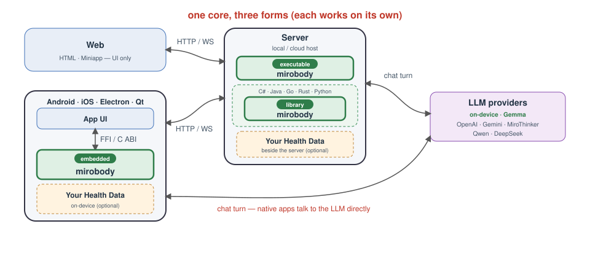
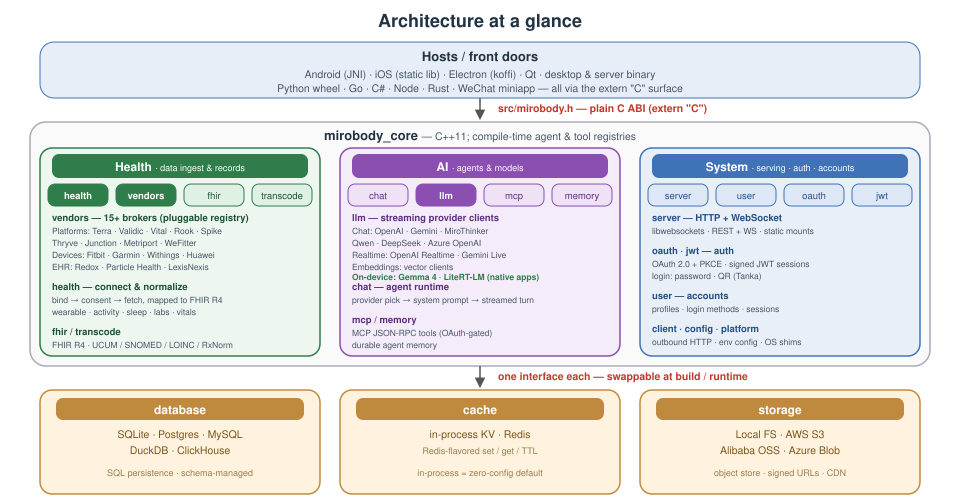
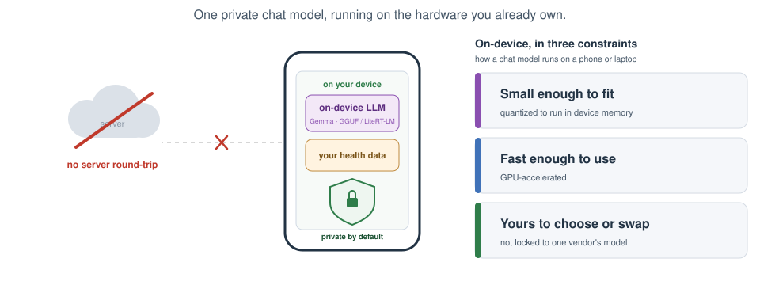

# Mirobody v2

> The C++ port of the [Python mirobody server](https://github.com/thetahealth/mirobody/tree/main), built to run *inside* the
> Android and iOS host app as well as standalone on desktop or a server.
> Because the core runs on-device, **all data can stay on the phone** - it
> never has to leave the device unless you choose to sync it.

**Live demo:** [test.mirobody.ai](https://test.mirobody.ai)

<p align="center">
  
</p>

<p align="center">
  
</p>

<p align="center">
  
</p>

A lightweight C++ server that links personal health data to LLMs - it pulls
wearable, lab, and clinical records from health-data platforms and feeds them to
multiple LLM providers behind one uniform interface. Five pieces make
up the core:

- **LLM clients** ([src/llm/](src/llm/)) - one streaming
  [`llm::Client`](src/llm/client.hpp) per provider (OpenAI, Google Gemini, and
  MiroThinker today), with new providers slotting in behind the same contract.
  The native apps (Android · iOS · Qt · Electron) additionally offer a fully
  **on-device** option — LiteRT-LM (Gemma 4 / Qwen) on mobile, llama.cpp (any GGUF)
  on desktop — so chat can run with no server and no network at all.
- **MCP tools** ([src/mcp/](src/mcp/) + [res/mcp_tools/](res/mcp_tools/)) -
  server-side tools exposed over a Model Context Protocol endpoint for clients
  to discover and call.
- **Agents** ([src/chat/](src/chat/) + [res/agents/](res/agents/)) - pick a
  client by provider name, build the system prompt, and stream a turn back.
- **Health platforms** ([src/health/vendor/](src/health/vendor/)) - one
  [`vendor::Vendor`](src/health/vendor/vendor.hpp) per source, brokering wearable,
  lab, and clinical-EHR data behind a common authorize / fetch / webhook contract,
  resolved by id through the [registry](src/health/vendor/registry.hpp). Each
  implements transport against the platform's public API (`fetch` everywhere, plus
  consent/webhook where documented; undocumented operations stay explicit stubs).
  Clients sort into three buckets:
  - `platform/` - 15 B2B aggregators (Terra, Validic, Human API, …)
  - `phone/` - smartphone-vendor stores with a cloud API (Huawei)
  - `device/` - consumer device brands (Fitbit, Withings, Garmin)
  - `ehr/` - direct EHR systems via SMART on FHIR — one generic client for every
    ONC-certified EHR (Epic, Oracle Health/Cerner, athenahealth, …), with a
    directory loader that discovers each tenant's FHIR base URL from public
    Service Base URL lists (ONC Lantern, vendor bundles)
  - on-device-only stores (Apple Health, Samsung Health, Google Health Connect,
    Xiaomi) have no server API and so no client — the host apps read them on-device
    (Health Connect / HMS Health Kit on Android, HealthKit on iOS) and POST FHIR
    Observations instead

  See [src/health/vendor/README.md](src/health/vendor/README.md) for the platform comparison
  the metadata is drawn from, plus the per-vendor implementation-status table.
- **FHIR R4** ([src/fhir/](src/fhir/)) - an embedded RESTful FHIR R4 endpoint plus
  the terminology machinery behind it:
  - uploaded documents are parsed into indicators and values
  - units are normalized to UCUM; indicators mapped to SNOMED CT / LOINC / RxNorm
  - on-device health data the Android / iOS apps read (Health Connect / HMS Health
    Kit / Apple HealthKit) is POSTed to the same write endpoint as `Observation`s
  - the results are served as FHIR resources

  See [src/fhir/README.md](src/fhir/README.md).

Agents and tools both self-register at compile time: drop a `.cpp` in the
matching `res/` directory and rebuild.



On desktop/embedded it runs as a standalone binary serving HTTP + WebSocket over
the network. On Android and iOS the same core ships inside the host app - as a
shared library loaded over JNI on Android, and as a static library linked
through the C API in [src/mirobody.h](src/mirobody.h) on iOS.

That C API is a plain `extern "C"` surface, so any language with a C FFI can
embed the core without going through the HTTP/WebSocket front door - Java
(JNI/JNA/Panama), Go (cgo), C# (P/Invoke), Rust (`extern "C"`), Swift,
Python (ctypes/cffi), and so on.



Health data flows the same way with or without a backend. With a server, device
uploads land in a transient `health_ingest_staging` inbox that a background worker
drains into Postgres (hot: `health_indicators` + `health_facts`) and Parquet (cold,
raw), while `fhir_resources` keeps the FHIR-truth summary `Observation`s. Fully
on-device, the same `mirobody_core` pipeline runs inline into a local SQLite file
with the identical schema — no inbox, worker, or cold tier.


## Why open device access

If a wearable's moat were purely its **algorithms**, opening the raw Bluetooth (BLE GATT)
layer wouldn't threaten it — yet most consumer vendors keep it closed. The commonly cited
reasons are market dynamics, not any one company's practice:

- **The moat is usually broader than the algorithm** — a historical-data flywheel plus
  subscriptions that sell processed *outputs* (scores, readiness), which open raw access can
  dilute.
- **Little upside for incumbents** — at scale a developer ecosystem barely moves hardware
  sales, while an open protocol costs documentation, compatibility, and support. The
  incentive is asymmetric: low for large players, high for open ones.
- **Path dependency** — products designed closed years ago are expensive to reopen (pairing,
  security model, every existing app).

The public counter-example is **Polar**: its H10/H9 chest straps implement the standard GATT
Heart Rate service, so any app can read them directly — and by many accounts that openness
helped make them a default heart-rate source for developers.

mirobody's thesis: when your value isn't a locked algorithm subscription, **open ingestion
is a feature, not a leak.** It reads whatever speaks an open standard — standard BLE GATT
sensors (and legacy classic-Bluetooth HDP devices), the phone health stores (Apple Health /
Health Connect / HMS), and EHRs over SMART on FHIR — normalizes everything to FHIR R4, and
keeps it on your device unless you choose to share it. See
[src/health/README.md](src/health/README.md).

## On-device LLM

The native clients (Android · iOS · HarmonyOS · Electron · Qt) can run the **chat turn entirely
on the device** — private by default, offline, and with no server or API key. A small
model (1–4B parameters at 4-bit) is downloaded on demand and managed in-app; only the
engine is bundled.

<p align="center">
  
</p>

**Where the model runs.** CPU works everywhere but is slow; the GPU is the practical
default today; the NPU is the most efficient but still too restricted for general LLMs.

| | CPU | GPU | NPU |
|---|---|---|---|
| **Speed** | slow | fast | fastest |
| **Power** | high | medium | low |
| **Built for** | general compute | parallel math / graphics | vision & speech |
| **Examples** | Intel · AMD · Apple/Arm | NVIDIA · AMD · Adreno · Mali · Apple GPU | Hexagon (Qualcomm) · ANE (Apple) · TPU (Pixel) |
| **LLM today** | last resort | **the practical default** | early, restricted |

**Which runtime runs on which backend** (● runs · ◐ early / limited):

| Runtime | CPU | GPU | NPU |
|---|:--:|:--:|:--:|
| **llama.cpp** | ● | ● | |
| **LiteRT-LM** | | ● | ◐ early |
| **ONNX Runtime** | ● | ● | ● QNN |
| **MLC-LLM** | | ● | |
| **system service** (AICore, Apple FM) | | | ● |

Desktop (Qt · Electron) runs **any GGUF** via llama.cpp — model-agnostic, managed in
**⚙ → On-device AI**; mobile (Android · iOS) runs Gemma 4 or Qwen via LiteRT-LM. HarmonyOS
also takes the GGUF route: llama.cpp is cross-compiled and linked into `libmirobody.so`, on
the **CPU** — and only the CPU. Vulkan built and ran there but measured slower on a Kirin 9020,
because offload copies every tensor into memory the CPU path just mmaps, so that backend is
gone rather than optional (numbers in
[harmony/build-llama.cmd](harmony/build-llama.cmd)). The fuller
picture — formats (GGUF / ONNX / LiteRT-LM), quantization, the runnable-model catalog,
and how it compares to Gemini Nano / Apple Foundation Models — is in the slide deck
[docs/on-device-llm.md](docs/on-device-llm.md) (a Marp deck; open in a Marp viewer or
export to PDF).

On-device is one of four lanes a turn can take. When it runs locally vs on a self-hosted
home server (a 32B-class model on the family's own box) vs a cloud provider on the user's
own API key — and where the user's data lives in each case — is in
[docs/privacy-tiers.md](docs/privacy-tiers.md).

## Quick start

The default desktop database backend is `POSTGRESQL`, so these install
the Postgres client (`libpq`) alongside the core deps. For other backends,
Fedora/RHEL packages, and full options, see [Building - desktop](docs/BUILDING.md#building---desktop).

The desktop build below needs no environment setup. The optional lanes further
down — Qt client, Android, HarmonyOS, on-device LLM — each need to know where you
installed *their* toolchain; no script hardcodes a path, and the variables are
collected in one table at
[Environment variables](docs/BUILDING.md#environment-variables).

> **Signing in — demo login is off by default.** A fresh checkout configures no
> email delivery or social provider, so to sign in without setting one up first,
> enable the built-in demo accounts: uncomment the `EMAIL_PREDEFINE_CODES` block
> in [`config.example.yml`](config.example.yml) (it maps `demo1@mirobody.ai` →
> `777777`, and so on). It ships **commented out on purpose** — while active,
> anyone who can reach the server could sign in with those well-known
> credentials, so keep it disabled on any reachable deployment and rely on real
> email-code or social sign-in there. Every mention of demo credentials below
> assumes you have enabled this block.

### Linux

```sh
# Debian / Ubuntu / WSL
sudo apt install build-essential cmake ninja-build pkg-config \
                 libwebsockets-dev libcurl4-openssl-dev libssl-dev \
                 rapidjson-dev libyaml-cpp-dev libhiredis-dev libpq-dev \
                 libjpeg-dev libpng-dev libtiff-dev libwebp-dev
./build.sh          # -> build/mirobody
./mirobody          # reads ./config.yml
```

### macOS

```sh
brew install cmake ninja pkg-config libwebsockets curl openssl@3 \
             rapidjson yaml-cpp hiredis libpq \
             jpeg-turbo libpng libtiff webp
./build.sh          # -> build/mirobody
./mirobody          # reads ./config.yml
```

> **Note — response compression.** The distro/Homebrew `libwebsockets` packages
> are built with `LWS_WITH_HTTP_STREAM_COMPRESSION` **off**, so a server linked
> against them serves every response *uncompressed* (e.g. `assets/index.js` at
> ~520 KB). That's fine for local development. The production
> [Docker image](Dockerfile) instead builds libwebsockets from source with
> `-DLWS_WITH_HTTP_STREAM_COMPRESSION=ON -DLWS_WITH_ZLIB=ON` so it gzip/deflates
> responses — do the same for any bandwidth-sensitive deployment.

### Windows

Install Visual Studio with the **Desktop development with C++** workload and the
**C++ CMake tools** component (provides Ninja and a bundled vcpkg). vcpkg pulls
the native deps from [`vcpkg.json`](vcpkg.json) automatically - no manual installs.

```cmd
build.cmd           :: configure + build -> build\mirobody.exe
build\mirobody.exe  :: reads .\config.yml
```

### Webpage

The web client is a static single-page app in [`htdoc/`](htdoc/), served by the
standalone desktop/server binary (the mobile builds have no static surface).
Build it into `res/htdoc`, where `HTTP_ROOT` points by default; `mirobody` then
serves it at `http://localhost:8080`:

```sh
cd htdoc
npm install
npm run build       # -> res/htdoc, served by mirobody at :8080
```

For live-reload development, run the webpack dev server (port 8090) - it proxies
API calls to a `mirobody` backend on :8080:

```sh
npm start
```

The login screen offers email one-time-code sign-in plus whichever social
providers are configured - Google / Apple / X (via Firebase), WeChat, GitHub, and
**Tanka QR-code login** (on by default). Tanka is the one provider with a runtime
`node` dependency: the server self-heals Tanka's request-signer by running
`res/tanka/discover.cjs` at boot and weekly, falling back to a pinned build when
`node` or Tanka is unavailable. See [src/user/README.md](src/user/README.md) for
the flow and the `TANKA_*` keys in [config.example.yml](config.example.yml).

### Android

Native deps come from prebuilt sysroots under `android/prebuilt/<ABI>/`
(`arm64-v8a` only today). Then build the host app, which bundles
`libmirobody.so`:

```sh
cd android
./gradlew assembleRelease
```

See [Building - Android](docs/BUILDING.md#building---android) for the prebuilt-sysroot setup.

### iOS

Native deps come from prebuilt sysroots under `ios/prebuilt/<sdk>-<arch>/`.
Build the `arm64` device slice and link it into the SwiftUI host via the C API:

```sh
cmake -S . -B build-ios-arm64 -G Xcode \
    -DCMAKE_TOOLCHAIN_FILE=path/to/ios.toolchain.cmake \
    -DPLATFORM=OS64 -DDEPLOYMENT_TARGET=15.0 \
    -DCMAKE_PREFIX_PATH="$(pwd)/ios/prebuilt/iphoneos-arm64"
cmake --build build-ios-arm64 --config Release
```

See [Building - iOS](docs/BUILDING.md#building---ios) for the simulator slice, the xcframework
packaging, and Swift usage.

### HarmonyOS Next

[`harmony/`](harmony/) is an **ArkTS / ArkUI** (stage model) app for HarmonyOS Next — bundle
`ai.thetahealth.mirobody`, phone / tablet / 2in1. It embeds the core the way the Android app
does, `libmirobody.so` over **NAPI** instead of JNI. What sets it apart from every other
client: it talks to **no mirobody server at all**. There is no backend URL and no account — a
turn either goes straight to an LLM provider's own OpenAI-compatible endpoint with a key the
user pasted (BYOK), or runs a GGUF locally through llama.cpp. Chat history is consequently
local, and the server- and account-shaped features (care circle, EHR, device linking) are
absent by construction rather than pending. Health data is the one that survives the
constraint: it reads 华为运动健康 through **Health Service Kit** and keeps the FHIR
Observations in the app's own SQLite, where the `family_health` MCP tool reaches them
during a turn — a health question answered with nothing leaving the phone.

Build in **DevEco Studio 6.0**. The native module's dependencies are cross-compiled per ABI
first (`arm64-v8a`, device only):

```cmd
harmony\build-prebuilt.cmd arm64-v8a     :: -> harmony\prebuilt\arm64-v8a\
harmony\build-llama.cmd arm64-v8a        :: optional -> harmony\prebuilt\llama-sdk\arm64-v8a\
```
```sh
harmony/build-prebuilt.sh arm64-v8a
harmony/build-llama.sh arm64-v8a
```

Two producers, one `prebuilt\` tree: the first lays down the core's vcpkg
dependencies, the second the llama.cpp engine that turns the on-device lane on.
The module's CMake finds both by repo-relative path, so there is nothing to
configure and nothing machine-local to keep out of a commit.

> [!IMPORTANT]
> **Before opening `harmony/` in DevEco Studio — once per clone:**
>
> ```sh
> git update-index --skip-worktree harmony/build-profile.json5
> ```
>
> DevEco writes your local signing block — cert paths and passwords — into that **tracked**
> file, and the flag does not survive cloning. Skip this and the signing material shows up
> as a committable change.

Then generate a debug signature in DevEco (Project Structure → Signing Configs →
*Automatically generate signature*). Chat needs no server: paste a provider key in the app,
add a model, and send.

See [harmony/README.md](harmony/README.md) for the lane/transport split (why the embedded core
is a transport rather than a lane), live BYOK model discovery, and how a GGUF is referenced
rather than copied.

### Desktop (Electron)

[`electron/`](electron/) wraps the server in an Electron desktop app: the main
process embeds `libmirobody` **in-process** via koffi FFI (the same C API as the
other FFI hosts) and a `BrowserWindow` loads the `htdoc` web client from the
embedded server's loopback port - no separate process, and no `electron-rebuild`
across Electron's Node versions. Build the shared library and the web client
first, then run from the repo root:

```sh
./build-shared.sh                 # -> build-shared/libmirobody.* (build-shared.cmd on Windows)
( cd htdoc && npm run build )     # -> res/htdoc (already built in a fresh checkout)
( cd electron && npm install && npm start )
```

It uses the self-contained SQLite backend, so no external database is needed;
the embedded server runs off the committed [config.example.yml](config.example.yml),
so enable demo login there (uncomment `EMAIL_PREDEFINE_CODES` — see the note under
[Quick start](#quick-start)), sign in with `demo1@mirobody.ai` / `777777`, and add
an LLM key to enable chat. `npm run dist` packages it with
electron-builder.

See [electron/README.md](electron/README.md) for the `extraResources` packaging
layout, the writable-vs-read-only path handling, and the fixed-port note.

### Desktop (Qt)

[`qt/`](qt/) is a native **Qt Quick (QML)** desktop client - the C++ counterpart
of the web client in `htdoc/`. Unlike Electron, it does **not** embed
`libmirobody`; it is a pure HTTP/SSE API client built on Qt's networking stack,
so it talks to any running `mirobody` backend over the network. It mirrors the
web client's main flow (email-code login, streamed agent/proxy chat, provider
picker, history, settings, ten languages). It is off by default and needs
**Qt 6.5+**. On **Windows build with MSVC** (the `msvc2022_64` kit; matches
`build.cmd` and LiteRT-LM's Windows toolchain); on **Linux/macOS use GCC/Clang**.

```cmd
:: Windows (MSVC) — standalone wrapper script in qt/, no mirobody_core deps needed
qt\build-qt.cmd deploy   :: -> build-qt\app\mirobody_qt.exe (windeployqt'd)
```
```sh
# Linux / macOS
qt/build-qt.sh           # -> build-qt/app/mirobody_qt

# ...or from the top-level build on any OS:
cmake -B build-qt -S . -DMIROBODY_BUILD_QT=ON \
      -DCMAKE_PREFIX_PATH=/path/to/Qt/6.x/<compiler>
cmake --build build-qt --target mirobody_qt
```

Launch it, open **⚙ → Backend** to point at a server (default
`http://127.0.0.1:8080`), and sign in with a demo code once demo login is enabled
on that backend (uncomment `EMAIL_PREDEFINE_CODES`; e.g. `demo1@mirobody.ai` /
`777777`). Because the target pulls in no `mirobody_core` deps, it can also be
built on its own.

See [qt/README.md](qt/README.md) for the architecture, the API mapping, and the
two intentional omissions (social sign-in, KaTeX math).

### Wechat Miniapp

A native WeChat Mini Program client lives in [`miniapp/`](miniapp/) (WXML/WXSS/JS,
no build step). It mirrors the web client: the same `{code, msg, data}` envelope,
bearer-JWT auth, and streamed `/api/chat` agent protocol. Open the folder in
**WeChat DevTools** as a Mini Program project - it runs directly,
no `npm install`:

```
miniapp/
  project.config.json   # set your Mini Program AppID here
  config.js             # backend baseUrl (dev: http://localhost:8080) + language
  pages/login/          # wx.login() -> POST /wechat/verify -> token
  pages/chat/           # provider picker + streamed agent chat
```

Login goes through **`POST /wechat/verify`**: the page hands the `wx.login()`
code to the server, which exchanges it via WeChat's `jscode2session`
(`WECHAT_APPID` / `WECHAT_SECRET` in [`config.yml`](config.yml)) for the user's
openid and mints the same tokens as `/email/verify`.

See [miniapp/README.md](miniapp/README.md) for the full setup, the backend
contract, and the streaming-over-`wx.request` details.

## Feature parity

Where each client stands today. **✅ done · 🚧 partial · — not yet.** Electron
embeds the [`htdoc`](htdoc/) web UI, so it inherits every web feature and adds an
on-device LLM. Harmony's dashes in *Accounts* and in the sharing half of *Health*
are structural, not a backlog: it speaks to no mirobody server, so there is nothing
to sign into and nobody to share records with. Reading the phone's own health store
needs no server, so that one it does (see [HarmonyOS Next](#harmonyos-next)).

| Feature | Web | Android | iOS | Harmony | Electron | Qt | Miniapp |
|---|:--:|:--:|:--:|:--:|:--:|:--:|:--:|
| **Chat & content** | | | | | | | |
| Streaming replies | ✅ | ✅ | ✅ | ✅ | ✅ | ✅ | ✅ |
| Thinking / reasoning trace | ✅ | ✅ | ✅ | ✅ | ✅ | ✅ | ✅ |
| Tool-call cards (MCP) | ✅ | ✅ | ✅ | 🚧 | ✅ | — | — |
| Markdown | ✅ | ✅ | ✅ | 🚧 | ✅ | ✅ | — |
| Math (LaTeX / KaTeX) | ✅ | ✅ | ✅ | ✅ | ✅ | — | — |
| Charts (ECharts) | ✅ | ✅ | ✅ | ✅ | ✅ | — | — |
| Inline images | ✅ | ✅ | ✅ | — | ✅ | — | — |
| Attachment upload | ✅ | ✅ | ✅ | — | ✅ | — | ✅ |
| **Model** | | | | | | | |
| Provider / model picker | ✅ | ✅ | ✅ | ✅ | ✅ | ✅ | ✅ |
| On-device LLM | — | ✅ | ✅ | ✅ | ✅ | ✅ | — |
| **Accounts & privacy** | | | | | | | |
| Sign in | ✅ | ✅ | ✅ | — | ✅ | ✅ | ✅ |
| Multi-account switch | ✅ | ✅ | ✅ | — | ✅ | ✅ | ✅ |
| Account avatar + nav drawer | ✅ | ✅ | ✅ | 🚧 | ✅ | ✅ | ✅ |
| Incognito mode | ✅ | ✅ | ✅ | ✅ | ✅ | ✅ | ✅ |
| Chat history + resume | ✅ | ✅ | ✅ | ✅ | ✅ | ✅ | ✅ |
| **Health & sharing** | | | | | | | |
| Phone health read | — | ✅ | ✅ | 🚧 | — | — | 🚧 |
| EHR (SMART on FHIR) | ✅ | ✅ | ✅ | — | ✅ | ✅ | — |
| Device / vendor connect | 🚧 | ✅ | ✅ | — | 🚧 | ✅ | — |
| Care circles / sharing | ✅ | ✅ | 🚧 | — | ✅ | 🚧 | ✅ |
| **Settings** | | | | | | | |
| Language switch (i18n) | ✅ | ✅ | ✅ | 🚧 | ✅ | ✅ | 🚧 |
| Font size | ✅ | ✅ | ✅ | ✅ | ✅ | ✅ | ✅ |
| Backend URL | ✅ | ✅ | ✅ | — | ✅ | ✅ | ✅ |
| Dark theme | — | ✅ | ✅ | ✅ | — | — | — |

**Notes**

- **On-device LLM** — LiteRT-LM (Gemma 4 / Qwen) on Android / iOS; llama.cpp (any
  GGUF) on Qt / Electron / Harmony, where it is linked into `libmirobody.so` and runs
  on the CPU backend. A plain browser has no on-device model; the web app exposes
  it only when running inside Electron. See [On-device LLM](#on-device-llm).
- **Harmony chat & content** — markdown covers headings, lists, quotes, fenced code,
  GFM tables and inline styling, with block ids stable across a streaming re-parse;
  links still render as source, and there is no markdown-image or attachment path yet.
  MCP tools do *run* (native turns go through the C++ agent pipeline) and `render_chart`
  reaches the UI as an ECharts block, but the per-step tool card is not built, so
  `queryDetail` is dropped. Math and charts render to SVG/PNG files through one hidden
  Web component, keeping the chat list native.
- **Harmony drawer / settings** — the hamburger drawer is the app's only menu and holds
  the settings group, but has no account rows or avatar (no account exists). The theme
  control is a superset of Android's: follow-system *or* pinned light / dark. Language
  offers 简体中文 and English only. There is no Backend URL setting — each provider's
  `baseUrl` is edited in the key manager instead.
- **Phone health read** — Health Connect + HMS Health Kit (Android), HealthKit
  (iOS); the miniapp reads WeChat WeRun step data only. Qt and iOS additionally
  ingest BLE sensors directly. Harmony reads 华为运动健康 through **Health Service
  Kit** and, having no server to POST to, stores the Observations in its OWN
  on-device FHIR table, where the `family_health` MCP tool picks them up mid-turn
  ([harmony/README.md § Health data](harmony/README.md#health-data)). 🚧 because it
  is inert until the AppGallery Connect health scopes are approved, and because it
  maps eight metrics rather than everything the Kit exposes.
- **Device / vendor connect** — connect / list / disconnect for cloud vendors
  (Fitbit, Withings, Garmin, Terra, …) is fully wired on Android / iOS / Qt; on
  Web / Electron the list and disconnect work but the connect OAuth flow is still a
  placeholder.
- **Care circles / sharing** — create / manage circles and share threads on
  Android, Web / Electron and Miniapp; iOS and Qt can open a conversation shared
  *to* you (read-only) but can't create shares yet.
- **Miniapp language** — the picker sets the model's reply language; the UI copy
  itself is Chinese only.
- **Dark theme** — Android and iOS follow the system light / dark scheme, Harmony adds
  a pin-light / pin-dark override on top; the other clients ship a single light palette.
- **iOS math** — MarkdownUI has no KaTeX equivalent, so math-bearing replies render
  through an offline KaTeX WebView (`MathMarkdownText`); plain replies stay on native
  MarkdownUI. Math resolves when the turn settles — mid-stream it shows as source.

## Database

`mirobody_core` keeps its in-process SQL persistence behind a single `Database`
class, linking exactly one concrete backend at build time:

- **Backends** — `SQLITE` / `DUCKDB` / `POSTGRESQL` / `POSTGRESQL_LEGACY` / `MYSQL` / `CLICKHOUSE`, selected via the `MIROBODY_DATABASE_BACKEND` CMake option.
- **Defaults** — `SQLITE` on mobile, `POSTGRESQL` on desktop / server.
- **One per build** — the backend is chosen at compile time, so call sites stay backend-agnostic.

See [src/database/README.md](src/database/README.md) for the full backend
matrix, build-target defaults, the preprocessor macros each value defines, and
the SQL-portability notes across the five dialects.

## Cache

`mirobody::cache::Cache` is a Redis-flavored key/value store behind one type,
with a pluggable backend:

- **API** — `set` / `get` / `incr` / `decr` / `exists` / `del` / `expiretime` / `prune` / `flushdb` / `dbsize`.
- **Backends** — in-process `MemoryKv` (zero-config default) or a hiredis-backed Redis connection.
- **Uniform** — both expose the same `Cache open() const` shape, so call sites read the same regardless of backend.

See [src/cache/README.md](src/cache/README.md) for the usage example, the
expiration / eviction semantics, and the `MemoryKv` direct-access notes.

## Storage

`mirobody::storage::Storage` is an object-store interface with runtime-selected
backends:

- **API** — `put_object` / `get_object` / `delete_object` / `presigned_url` / `public_url`.
- **Backends** — AWS S3 / S3-compatible, Alibaba Cloud OSS, Azure Blob, and local filesystem. Unlike the SQL `Database` (one backend linked per build), all compile into every build and the caller picks one at runtime from config.
- **User uploads** — `put_user_object` stores bytes under a per-user, content-addressed key (HMAC-hashed user segment and digest, content-type-derived suffix) with a `<key>.meta` metadata sidecar; `list_user_objects` scans a user's prefix back.

See [src/storage/README.md](src/storage/README.md) for the backend table, the
`configured()` / `open()` usage example, the user-object key scheme,
`LocalStorage` setup, the named-OSS getter, and where request signing lives and
is tested.

## Memory

`mirobody::memory::Memory` is a long-term memory interface — `remember` /
`recall` / `forget` — that stores durable facts about a user and recalls the
most relevant ones for a turn, surfaced to agents as the `remember` /
`recall_memory` MCP tools. Every backend compiles in; the caller picks one at
runtime via `MEMORY_PROVIDER`:

- **`local`** *(default)* — facts plus 1024-dim embeddings in the app `Database`, ranked by in-process cosine over the caller's own rows; no extra services, works on every SQL backend.
- **`everos`** — an EverOS-compatible remote memory service.
- **`mem0`** — [Mem0](https://mem0.ai).
- **`zep`** — [Zep](https://getzep.com).

These remote adapters talk to a SOTA memory service over HTTP. It is the
mirobody analog of [EverOS](https://github.com/EverMind-AI/EverOS)'s memory
subsystem.

See [src/memory/README.md](src/memory/README.md) for the backend table, the
`make_memory()` usage example, the local cosine / pgvector-upgrade notes, the
remote-adapter caveats (opaque ids, server-side extraction), the config keys,
and how to add a backend.

## Vendor

`mirobody::vendor::Vendor` is a health-data source interface — `authorize_url` /
`list_providers` / `fetch` / `handle_webhook` / `revoke` — over brokers of
wearable, lab-diagnostic, and clinical-EHR data. Every vendor compiles in; the
caller picks one at runtime by id via `open_vendor()`. The clients live under
[src/health/vendor/](src/health/vendor/) in three buckets:

- **`platform/`** — 15 B2B aggregators (Terra, Validic, Human API, Junction, Metriport, …).
- **`phone/`** — smartphone-vendor stores with a cloud API (Huawei).
- **`device/`** — consumer device brands (Fitbit, Withings, Garmin).
- on-device-only stores (Apple, Samsung, Google Health Connect, Xiaomi) have no client and feed the FHIR endpoint instead.

Alongside real, queryable `VendorInfo` metadata, each vendor implements transport
against the platform's public API: `fetch` everywhere (the vendor's native JSON or
FHIR, per platform), plus consent and webhook operations where the contract is
documented. Per-deployment hosts (self-hosted or contract-gated) require an
explicit `base_url` rather than a guessed one, and operations with no public
contract stay `VendorError` stubs — never fabricated.

See [src/health/vendor/README.md](src/health/vendor/README.md) for the competitive matrix the
metadata is drawn from - positioning, data-source coverage, compliance posture,
and integration style across all 15 platforms - and the implementation-status
table tracking which operations are live per vendor.

## Config

Config is resolved from layered sources, merged per key with higher layers
overriding lower:

- **Precedence** (high → low) — environment variables → `config.yml` → remote config → committed `config.example.yml` template.
- **Local** — copy `config.example.yml` to `config.yml` (git-ignored) and edit that.
- **Remote** — pulled only when `CONFIG_SERVER` / `CONFIG_TOKEN` / `ENV` are all set (`ENV` selects which remote environment to fetch; it doesn't affect local files).
- **Encrypted values** — values beginning with `gAAAA` are Fernet-decrypted on load when `CONFIG_ENCRYPTION_KEY` is set, one key shared across every source.
- **Sub-path mounting** — `HTTP_URI_PREFIX` can mount the whole app under a sub-path.
- **Upload size** — `HTTP_MAX_BODY_BYTES` caps one request body, 32 MiB by default (`0` disables); a proxy in front has its own limit, and the smaller wins.

See [src/config/README.md](src/config/README.md) for the full precedence list,
an example `config.yml`, the URI-prefix (sub-path mounting) details, remote-
config pull, and the encrypted-values derivation.

### Google: AI Studio or Vertex AI

The Gemini models are reachable on two surfaces, and **naming a project and a
location is what selects Vertex** — for every Google call the server makes, chat
and embeddings alike. Leave either unset and both stay on AI Studio.

| Key | Meaning |
| --- | --- |
| `GOOGLE_API_KEY` | AI Studio key. All that is needed for the default surface. |
| `GOOGLE_CLOUD_PROJECT` | Vertex project id. Together with the next key, the switch. |
| `GOOGLE_CLOUD_LOCATION` | Where the model runs — see the caution below. |
| `GEMINI_BASE_URL`, `GEMINI_AI_STUDIO_BASE_URL`, `GEMINI_VERTEX_BASE_URL` | Host overrides, for a proxy or gateway in front. |

Those keys pick the surface; they say nothing about *who* the server is when it
gets there. Vertex needs a credential besides, and the next section is the whole
of that story — on GCP it is nothing at all.

#### How Vertex authenticates

Every Vertex call carries an OAuth bearer token, and there are five ways this
server can come by one. They are tried **in this order**, first hit wins —
`gcp::TokenSource` picks among the top three, and Application Default Credentials
resolves the rest exactly as `google.auth.default()` does
(`src/client/gcp_auth.hpp`). Nothing here needs configuring on GCP: leave all of
it unset and row 5 answers.

| # | Mechanism | Configured by | Use it when |
| --- | --- | --- | --- |
| 1 | **Token file** | `GCP_ACCESS_TOKEN_FILE` | Something outside the server keeps a raw token current — a sidecar, a projected volume. Re-read on every request, so a rotation needs no restart. |
| 2 | **Inline token** | `GCP_ACCESS_TOKEN` | Poking at a local run with `gcloud auth print-access-token`. Read once at startup, so it expires with the token (~1h) and every turn fails on auth after that. Not a deployment. |
| 3 | **Credential file** | `GOOGLE_APPLICATION_CREDENTIALS` | Off GCP. One path, three kinds of file — see below. |
| 4 | **gcloud ADC login** | nothing — the well-known path | A developer machine that has run `gcloud auth application-default login`. Same reader as row 3; the file is just found rather than named. |
| 5 | **Metadata server** | nothing | On GCE / GKE / Cloud Run. The instance's attached service account, no key to store and none to rotate. **The production answer on GCP.** |

Rows 1 and 2 short-circuit the rest: set `GCP_ACCESS_TOKEN_FILE` and a
`GOOGLE_APPLICATION_CREDENTIALS` sitting next to it is never opened. That is the
intent — an explicit token is an override — but it also means a stale token file
left over from debugging silently outranks a correct credential. The startup log
says which mechanism won (`TokenSource::describe`, then `gcp auth: …` for the ADC
sources); read it before debugging a `401`.

Rows 3–5 are Application Default Credentials, and rows 3 and 4 are **one slot,
not two steps**: `GOOGLE_APPLICATION_CREDENTIALS` if set, otherwise the path
`gcloud` writes (`%APPDATA%\gcloud\application_default_credentials.json` on
Windows, `~/.config/gcloud/…` elsewhere). Whichever file is found, its `type`
field decides the grant:

| `type` | Grant | Where it comes from |
| --- | --- | --- |
| `service_account` | Signed JWT (RFC 7523) against the key's `token_uri` | A downloaded key. Works anywhere; it is also a long-lived secret you now own. |
| `authorized_user` | `refresh_token` grant | `gcloud auth application-default login`. Your own account, not a workload's — fine for a laptop, wrong for a server. |
| `external_account` | STS token exchange | Workload identity federation. **Prefer this off GCP** — no key exists to leak or rotate. |

A file whose `type` is none of the three, or which is missing the fields its
grant needs, is logged and skipped — the server falls through to the metadata
server, which off GCP cannot answer. That combination (`GOOGLE_APPLICATION_CREDENTIALS`
pointing somewhere unreadable, then a metadata timeout) is the usual shape of a
Vertex deployment that authenticates on a laptop and not in its container.

Two failure modes worth naming because each looks like the other's opposite:
credentials without `GOOGLE_CLOUD_PROJECT` + `GOOGLE_CLOUD_LOCATION` leave the
server quietly on AI Studio, and those two without a credential is the
`Vertex mode has no access token` error.

**Authenticating from outside GCP with workload identity federation.** Point
`GOOGLE_APPLICATION_CREDENTIALS` at the `external_account` file `gcloud iam
workload-identity-pools create-cred-config` writes: no service-account key is
stored and no key has to be rotated. Which `credential_source` that file carries
decides how the workload proves who it is, and the choice is not a detail — one
of the two shapes cannot work in a container at all.

*A token file* (`credential_source: {file: ...}`) is the shape to want. The
workload's own platform writes a signed OIDC token somewhere and this server reads
it, re-reading per token mint so a rotation needs no restart. On Kubernetes that
is a projected `serviceAccountToken` volume whose `audience` matches the Google
provider, federated against the cluster's OIDC issuer — nothing about AWS is
involved, and it works identically on EKS, GKE and anything else running
Kubernetes. Needs an **OIDC** provider on the Google side; an AWS provider only
accepts SigV4 signatures and will reject a JWT.

*`aws1`* signs an AWS `GetCallerIdentity` request with SigV4 and lets Google's STS
replay it, exactly as `google.auth.aws` does (checked byte for byte in
`tests/client/gcp_auth_test.cpp`). The AWS credentials that sign it are looked for
in three places, in order:

1. **The environment** — `AWS_ACCESS_KEY_ID` + `AWS_SECRET_ACCESS_KEY` (+
   `AWS_SESSION_TOKEN`), taken only when both halves are present. With
   `AWS_REGION` set too this needs no metadata server at all, which is what makes
   `aws1` work on Lambda.
2. **IRSA** — `AWS_ROLE_ARN` + `AWS_WEB_IDENTITY_TOKEN_FILE`, the identity a
   Kubernetes pod on EKS actually has. The projected token is exchanged for
   temporary credentials through `AssumeRoleWithWebIdentity`, which needs no
   signature of its own. **This step goes beyond `google.auth.aws`**, whose
   built-in credential source reads only the metadata server; google-auth leaves
   the case to `AwsSecurityCredentialsSupplier`, a hook each application
   implements (the Python service in this stack does it via boto3). Doing it here
   means a deployment configures it once and the credential file needs no
   `credential_source` changes.
3. **EC2's instance metadata server** — the instance profile. Reachable from an
   instance, usually not from a pod: EKS both requires IMDSv2 and leaves the
   metadata hop limit at 1, so a container's `PUT /latest/api/token` is dropped
   while unauthenticated reads answer `401`. That deadlock is why step 2 exists.
   On an instance that does require IMDSv2, the credential file must name
   `imdsv2_session_token_url` (`gcloud ... create-cred-config --enable-imdsv2`);
   including it is always safe, since IMDSv2 works even where v1 is still allowed.

**ECS and Fargate** serve the task role at `169.254.170.2`, an address neither
this implementation nor `google.auth` reads — export the environment variables in
step 1 there.

Both shapes support `service_account_impersonation_url`, which swaps the
federated token for a service account's once the exchange succeeds — and both
still need `GOOGLE_CLOUD_PROJECT` and `GOOGLE_CLOUD_LOCATION` besides. Splitting
those two halves across two deployments is a quiet way to have neither work.

**`GOOGLE_CLOUD_LOCATION` is not any region you like.** Each model publishes its
own list, and a value outside it has no node at all — `gemini-3.6-flash` serves
`global` only, while `gemini-3.5-flash` adds the `us` / `eu` multi-regions and a
few single regions. Use `us` (**not** `us-east5`) to keep inference in the United
States, `eu` for the EU, or `global` for Google's routing, which is about 10%
cheaper with no residency guarantee. The model picker is built per surface, so a
Vertex deployment is offered only what Vertex can answer.

The location also picks the endpoint host, and the three kinds of location spell
it three different ways:

| Location | Host |
| --- | --- |
| a region, e.g. `us-central1` | `us-central1-aiplatform.googleapis.com` |
| a multi-region, `us` or `eu` | `aiplatform.us.rep.googleapis.com` |
| `global` | `aiplatform.googleapis.com` |

The multi-regions are Representative Endpoints, so the location is an **infix**,
not a prefix — `us-aiplatform.googleapis.com` is not an endpoint, and Google
answers it with `400 INVALID_ARGUMENT: Invalid hostname`. Nothing falls back.
`gcp::vertex_host` ([src/client/gcp_auth.hpp](src/client/gcp_auth.hpp)) is the
single place that knows the rule; the path after the host is identical for all
three.

#### One location cannot serve every model

`GOOGLE_CLOUD_LOCATION` is a **default**, not the whole answer, because a location
is a property of the *model*. The published lists do not merely differ between
models — they invert:

| | `us` / `eu` multi-region | US single regions |
| --- | --- | --- |
| `gemini-embedding-2` | ✅ | ❌ |
| `gemini-embedding-001` | ❌ | ✅ (all seven) |
| `gemini-3.5-flash` | ✅ | ❌ |
| `gemini-2.5-flash` | ❌ | ✅ |

Read down either column: **no single value serves everything this server offers.**
`us` gives you chat on 3.5-flash and a 404 on both `gemini-embedding-001` and
`gemini-2.5-flash`; a single region trades one set of 404s for the other. That is
not a misconfiguration waiting to be corrected — it is an unsatisfiable constraint.

`GOOGLE_CLOUD_MODEL_LOCATIONS` breaks it: a map from model id to the location that
model is reached at, consulted by both lanes, with `GOOGLE_CLOUD_LOCATION` as the
fallback for anything it does not name.

```yaml
GOOGLE_CLOUD_LOCATION: 'us'          # the fallback, for models not named below
GOOGLE_CLOUD_MODEL_LOCATIONS:
  gemini-embedding-001: 'us-west1'
  gemini-2.5-flash: 'us-west1'
  gemini-3.5-flash: 'us'
```

**This map ships live in [config.example.yml](config.example.yml)** while the rest
of the Vertex block stays commented, because the rest are switches and this is
correctness: a fresh clone that enables Vertex and takes the recommended `us`
would 404 on two models, which reads as "Vertex is broken" rather than "one line
is missing". Nothing reads the map until Vertex is on, so an AI Studio deployment
carries it for free. All three models are pinned explicitly rather than letting
the multi-region one ride the fallback, so changing `GOOGLE_CLOUD_LOCATION` later
moves only what was never pinned.

As an environment variable it is the same map as JSON — and an env value
**replaces** the file's map rather than merging into it, so name every model there
too: `GOOGLE_CLOUD_MODEL_LOCATIONS='{"gemini-embedding-001":"us-west1"}'`.

**Nothing is validated and nothing is inferred**, both on purpose.
`gcp::vertex_model_location` holds no table of what each model serves: Google's
lists move, and a stale table compiled in here would be a 404 no operator could
override, where a wrong map entry is Google's own 404 naming the model and the
location. Nor does it resolve `us` to a nearby region for a model that lacks it —
that would move data across a residency boundary the operator chose deliberately.
The startup log prints every override in force, which is the first thing to read
after a `Publisher model ... was not found` error.

One thing this does reach into: `gemini-3.5-flash` is about 10% cheaper on
`global`, so its price is computed from the location it will actually be reached
at rather than the deployment's ([res/agents/baseline.cpp](res/agents/baseline.cpp)).

`GCP_PROJECT` / `GCP_LOCATION` named those two keys in earlier revisions and are
no longer read — rename them. The server warns at startup if either is still set,
since a project that resolves to nothing is indistinguishable from a deployment
that never wanted Vertex. Every key is documented in
[config.example.yml](config.example.yml).

## Building

The native dependency list (with licenses), toolchain minimums, and full build
instructions for every target — desktop (Windows MSVC + vcpkg, and Linux / WSL /
macOS), Android, iOS, the Python wheel, and the C-ABI shared library for
embedding from Java / Go / C# / Node / Rust — live in
**[docs/BUILDING.md](docs/BUILDING.md)**.

The [Quick start](#quick-start) above has the condensed one-liner for the common
platforms; reach for the full guide when you need the dependency/toolchain
reference, cross-compilation, a non-default database backend, prebuilt-sysroot
setup, or the embedding bindings.

Every environment variable any build script reads is listed in one place —
[Environment variables](docs/BUILDING.md#environment-variables) — grouped by lane,
with what it points at and what happens if you leave it unset.

## HTTP API

| Method | Path          | Purpose                                              |
| ------ | ------------- | ---------------------------------------------------- |
| GET    | `/api/health` | Liveness probe - returns `ok`.                       |
| POST   | `/api/chat`    | Streams a chat response over SSE - runs the named agent, or (with no `agent` field) proxies the body to OpenAI `/v1/chat/completions`. Rate-limited per user (`CHAT_RATE_MAX` / `CHAT_RATE_WINDOW_SEC`; the shipped `config.example.yml` caps it at 5 turns / 60s, `0` disables). |

Paths are shown at the root; when [`HTTP_URI_PREFIX`](src/config/README.md#uri-prefix-sub-path-mounting)
is set they are served under it (e.g. `/mirobody/api/health`).

**Request body limit.** Every route caps one request body at
[`HTTP_MAX_BODY_BYTES`](src/config/README.md#request-body-limit) — **32 MiB by
default** — which is what bounds a `POST /api/chat` file upload. Over it the
request is answered `413` and the connection closed; the body is never buffered.

Errors come back as JSON:

```json
{ "code": -1, "msg": "..." }
```

A `413` carries the limit that was exceeded, so a client can say which file to
shrink and by how much:

```json
{ "code": -1, "msg": "request body too large", "data": { "max_bytes": 33554432 } }
```

## WebSocket routes

| Method | Path         | Purpose                                                                |
| ------ | ------------ | ---------------------------------------------------------------------- |
| GET    | `/api/chat`  | Live realtime bridge. JWT-guarded upgrade (bearer header or `?token=`); each inbound JSON frame (`{provider, system?, messages[]\|question}`) runs the matching realtime client (OpenAI Realtime / Gemini Live) and streams its events back as JSON frames, ending with `{"type":"end"}`. Shares the path with the `POST /api/chat` SSE route above. |

As with the HTTP routes, this is served under
[`HTTP_URI_PREFIX`](src/config/README.md#uri-prefix-sub-path-mounting) when it is set.

## MCP

A [Model Context Protocol](https://modelcontextprotocol.io) JSON-RPC 2.0
endpoint lets MCP clients discover and invoke server-side tools. The service
([src/mcp/service.hpp](src/mcp/service.hpp)) owns the route and dispatches the
standard methods (`initialize`, `tools/list`, `tools/call`, `ping`) to a
compile-time tool registry.

| Method | Path             | Purpose                                                      |
| ------ | ---------------- | ------------------------------------------------------------ |
| POST   | `/mcp`           | JSON-RPC endpoint; authenticate with a bearer JWT.           |
| POST   | `/mcp/{secret}`  | Same endpoint, authenticated by a personal-MCP secret in the URL - for clients that can't send a bearer token. |
| POST   | `/personal/mcp`  | Mint (or reuse) the caller's personal-MCP secret URL.        |

Discovery (`initialize` / `tools/list`) is unauthenticated; tools flagged
`auth` resolve the caller's identity from the bearer JWT or the personal-MCP
secret before running. An auth-flagged call with no valid token returns
`401` with a `WWW-Authenticate: Bearer resource_metadata="…"` header, which
points the client at the OAuth 2.0 authorization server below so it can obtain a
token. As with the other routes, paths are served under
[`HTTP_URI_PREFIX`](src/config/README.md#uri-prefix-sub-path-mounting) when set.

**Adding a tool.** Discovery is compile-time, not runtime: every file under
[res/mcp_tools/](res/mcp_tools/) is globbed into the build and self-registers
via a `MIROBODY_REGISTER_TOOL(...)` line. A tool declares its parameters in a
small table (C++11 has no signature reflection); the registry expands that into
the MCP `inputSchema` and the OpenAI / Gemini function-descriptor variants. Drop
a new `.cpp` in that directory, rebuild, and the tool is live - see
[res/mcp_tools/echo.cpp](res/mcp_tools/echo.cpp) for the smallest example and
[src/mcp/tool.hpp](src/mcp/tool.hpp) for the registry API.

## OAuth 2.0

An embedded OAuth 2.0 **authorization server** lets MCP clients (and any standard
OAuth client) obtain access tokens through the browser **authorization-code +
PKCE** flow, rather than a human pasting a bearer token. It issues the same
`mb_oauth` JWTs the MCP endpoint already verifies; end-user login and consent
reuse the existing web client.

| Method | Path                                        | Purpose                                   |
| ------ | ------------------------------------------- | ----------------------------------------- |
| GET    | `/.well-known/oauth-protected-resource`     | RFC 9728 resource metadata (root).        |
| GET    | `/.well-known/oauth-authorization-server`   | RFC 8414 server metadata (root).          |
| GET    | `/.well-known/openid-configuration`         | OIDC-discovery compatibility alias (same 8414 body). |
| GET    | `/.well-known/jwks.json`                    | Public JWKS for third-party token validators (RS256 only). |
| POST   | `/oauth/register`                           | RFC 7591 dynamic client registration.     |
| GET    | `/oauth/authorize`                          | Authorization endpoint → web consent.     |
| POST   | `/oauth/token`                              | `authorization_code` + `refresh_token`.   |
| POST   | `/oauth/revoke`                             | RFC 7009 revocation (best-effort).        |

The discovery documents are served at the host root (unaffected by
`HTTP_URI_PREFIX`); the endpoints they advertise carry the prefix. State
(registered clients, single-use codes) lives in the cache; refresh tokens are
stateless JWTs. Tokens are signed HS256 by default (`JWT_KEY`); set
`JWT_PRIVATE_KEY` to sign RS256 and publish a JWKS so third-party resource
servers can verify them without the secret. All keys are optional with working
defaults — see the `OAUTH_*` / `JWT_*` keys in [config.yml](config.yml) and
[src/oauth/README.md](src/oauth/README.md) for the flow, security model, and
configuration.

## FHIR

An embedded **RESTful FHIR R4** endpoint ([src/fhir/rest.hpp](src/fhir/rest.hpp))
serves health records as generic, validated FHIR JSON. The wider goal: an
uploaded document (lab report, discharge summary, …) is parsed into indicators
and values, the units are normalized to canonical UCUM, the indicators are
mapped to **SNOMED CT / LOINC / RxNorm** codes, and the results are
materialized as FHIR resources here. It is the C++ port of the runtime half of
the Python `mirobody.indicator` package (the offline artifact builders stay in
Python; the core only consumes their output).

| Method | Path                  | Purpose                                                  |
| ------ | --------------------- | -------------------------------------------------------- |
| GET    | `/fhir/metadata`      | CapabilityStatement (public discovery).                  |
| POST   | `/fhir`               | batch / transaction Bundle.                              |
| GET    | `/fhir/{type}`        | search → `searchset` Bundle (`_id` / `_count` / `_offset`). |
| POST   | `/fhir/{type}`        | create (server-assigned id) → 201.                       |
| GET    | `/fhir/{type}/{id}`   | read → 200 / 404 / 410 (deleted).                        |
| PUT    | `/fhir/{type}/{id}`   | update or create-with-id → 200 / 201.                    |
| DELETE | `/fhir/{type}/{id}`   | delete (idempotent) → 204.                               |

Bodies are `application/fhir+json`; errors come back as an `OperationOutcome`.
Resource routes require a bearer JWT and are scoped to the authenticated user;
`GET /fhir/metadata` is public. Resources are persisted as generic JSON in a
`fhir_resources` table via `database::Database`, with the server injecting `id`
and `meta` (`versionId` / `lastUpdated`). As with the other routes, paths are
served under [`HTTP_URI_PREFIX`](src/config/README.md#uri-prefix-sub-path-mounting)
when set.

**Status.** Unit normalization and the REST server are built; the terminology
resolver (indicator → code) and the document → FHIR pipeline are the next
milestones. See [src/fhir/README.md](src/fhir/README.md) for the phase table,
the generic-resource model, validation rules, and current limitations.

Reads and writes may target another user's records via `?subject=<member>` —
an opaque care-circle member handle, never a raw user id — when a
[care circle](#care-circles) authorizes it; without it they stay scoped to the
authenticated user.

## Care circles

A **care circle** layers opt-in sharing on top of the otherwise single-user core
— it's whoever you trust with your health (family, a partner, a caregiver). Two
things can be shared, each checked at the read/write path so no other table is
rescoped:

- **Conversations** — grant a fellow member view/edit access to one chat thread; it then appears in their history.
- **Health data** — a per-member, per-circle switch (off / view / edit) that lets accepted members read — or read+write — your FHIR records, so the AI can answer "how is my family doing?".

### Privacy — what the assistant can and can't reach

The view/edit switch governs **two separate planes**, and they are deliberately
asymmetric:

- **FHIR REST** (`?subject=<member>`) honors the full switch: `view` reads,
  `edit` reads **and writes** the sharer's records. This is the programmatic
  data plane (apps, integrations).
- **The AI assistant is read-only, always.** When you pick a member in the chat
  composer's "currently for" selector and ask on their behalf, exactly **one**
  tool — `family_health` — reads their data, and only with `view`-or-higher
  access. Even if they granted you `edit`, the assistant **never writes** to
  their records, memory, files, or chat history. `edit` matters only on the FHIR
  REST plane above.

Every other tool stays scoped to **you**, the signed-in caller, and never reads
or writes the subject's data:

| Tool | Acts on the "currently for" subject? |
| ---- | ------------------------------------ |
| `family_health` | **Yes** — read-only, gated by `view`+ health access |
| `whoami` | No — only flags that a subject is in focus (no id/data) |
| `list_files`, `read_file` | No — your uploads only |
| `recall_memory`, `remember` | No — your long-term memory only |
| `summarize_conversation` | No — your own current conversation only |
| `render_chart`, `echo` | No — touch no user data |

In other words, asking the assistant about a family member can only ever **read**
their health observations, and nothing the assistant does on their behalf can
modify their data or expose their files, memories, or conversations to you. See
[src/chat/README.md](src/chat/README.md) for the threading details
(`UserInfo::subject_user_id`).

A circle is a **group**: any two *accepted* members are mutually in it. Roles are
**Member / Maintainer / Owner** (maintainers and owners are admins who invite &
remove; owners also rename, delete, and change roles). Invites go out by email
and require acceptance.

| Method | Path | Purpose |
| ------ | ---- | ------- |
| POST | `/api/circle/create` \| `/rename` \| `/delete` | manage circles you own |
| POST | `/api/circle/invite` \| `/accept` \| `/decline` \| `/remove` | membership (invite by email, acceptance required) |
| GET\|POST | `/api/circle/members` | every circle you belong to, with your role + health level |
| POST | `/api/circle/role` \| `/nickname` \| `/health-sharing` | per-member role, label, and your own sharing level |
| POST | `/api/conversation/share` \| `/unshare`; GET `/api/conversation/shares` | share a conversation with co-members |

Cross-user references never expose the internal `users` primary key: members are
addressed by an opaque `member` handle (a `care_circle_members` row id) that the
server resolves back to a user with an access check, and the caller's own id only
ever comes from the JWT. Growth is bounded by configurable caps — the shipped
`config.example.yml` allows **5 circles per user** (`CIRCLE_MAX_PER_USER`) and
**5 members per circle** (`CIRCLE_MAX_MEMBERS`), with `0` disabling either.

Modern backends only — the schema lives under `res/sql/{pg,mysql,sqlite}` and the
legacy backend has no care-circle feature. See
[src/circle/README.md](src/circle/README.md) for the group model, the
role/permission matrix, the opaque-handle scheme, the limits, the health-access
seam (`?subject=` cross-user FHIR read/write via `circle::resolve_health_subject`),
and the full route list.

## Debug tools

The desktop build produces a small family of standalone CLIs under `cli/` that
bypass the embedded HTTP/WS server - the LLM debuggers (`mirothinker`,
`openai_chat`, `openai_responses`, `gemini`) each wrap one client in
[src/llm/](src/llm/), `aws_s3` / `aliyun_oss` drive the storage backends, and
`image` / `document` exercise the [src/transcode/](src/transcode/) transcoders
(image-for-vision compliance, and PDF/Excel/CSV → Markdown + image parts), and
`fhir` runs unit normalization (`fhir normalize "<5.6 mg/dL"`) and mints a
bearer JWT for the FHIR routes (`fhir token <user_id> --config <yaml>`), and
`jwt_keygen` generates an RSA keypair for RS256 JWT signing / JWKS publishing
(`jwt_keygen >> config.local.yaml`). Handy for poking at request parameters,
wire-format quirks, or bucket connectivity without rebuilding the server. Toggle
with `-DMIROBODY_BUILD_TOOLS=OFF`.

See [cli/README.md](cli/README.md) for the shared CLI UX, the per-binary
endpoint/credential table, YAML config keys, Gemini-path notes, and the storage
CLI command set.

For the web client (`htdoc/`), which has no devtools on a phone, open the app
with `?debug` (or `?vconsole`) to load an on-device console - a floating
log / network / element inspector - and `?debug=0` to turn it off. The choice is
remembered across reloads, and the console is code-split into its own chunk, so it
adds nothing to the normal bundle when off.

## Compliance — HIPAA & GDPR

Mirobody is built privacy-first: because the core runs on-device or self-hosted,
**personal health data never has to leave your device or your infrastructure**.
That architecture is the foundation for deploying in a HIPAA- or GDPR-compatible
way — the software gives you the controls, while the deployer remains the covered
entity / data controller responsible for the final compliance posture.

The tier model behind that claim — every configuration of *where the model runs* ×
*where the data lives*, what exactly leaves the device in each, and the guarantees the
code holds itself to — is documented in
**[docs/privacy-tiers.md](docs/privacy-tiers.md)**.

- **Keep PHI in-house.** On the phone (SQLite, offline) or self-hosted
  (PostgreSQL + local or regional object storage), no health record is sent to a
  third party unless you turn on an outbound integration. Care-circle sharing is
  opt-in and off by default, and the AI assistant is **read-only** over another
  member's data (see [Care circles](#care-circles)).

- **HIPAA — keep the LLM on-device, or choose a BAA-covered one.** The one place
  PHI can leave is the LLM call — so the native apps can run the model **fully
  on-device** (Gemma 4; pick the "On-device" provider), in which case nothing
  leaves at all. When you do use a hosted model, the public AI Studio /
  OpenAI-direct endpoints are not covered by a Business Associate Agreement, so
  for PHI route the same models through their BAA-eligible enterprise surfaces —
  both already supported:
  - **Google Gemini via Vertex AI** — set `GOOGLE_CLOUD_PROJECT` and
    `GOOGLE_CLOUD_LOCATION`; naming both is the switch, and calls then go to
    Google Cloud (covered by Google's BAA) instead of AI Studio. Credentials come
    from Application Default Credentials — the instance's service account on
    GCP, or `GOOGLE_APPLICATION_CREDENTIALS` pointing at a key file — so there is
    no token to rotate by hand.
  - **OpenAI GPT via Azure OpenAI** — set `AZURE_OPENAI_ENDPOINT` (the client
    auto-flips into Azure mode) with the deployment and key; calls run inside
    your own Azure resource (covered by Microsoft's BAA).

  See [Google: AI Studio or Vertex AI](#google-ai-studio-or-vertex-ai) for the
  full key list and the location caveat, and the `AZURE_OPENAI_*` keys in
  [config.example.yml](config.example.yml).

- **GDPR — data residency & sovereign clouds.** Self-host in your region and pin
  every outbound dependency to it: `GOOGLE_CLOUD_LOCATION` (a region, or the `eu`
  multi-region) and `GEMINI_VERTEX_BASE_URL` for the
  Gemini region, the Azure resource region for GPT, the object-storage region per
  backend (see [Storage](#storage)), and `AZURE_BLOB_ENDPOINT_SUFFIX` for
  sovereign clouds. The single-user core keeps records scoped per user, so
  subject data stays locatable for access and erasure requests.

## Layout

```
src/                    # C++ core
  mirobody.h            # public C ABI (extern "C") — the embedding surface
  main.cpp              # standalone server entry point
  server/               # HTTP + WebSocket routing on libwebsockets
  chat/                 # agents: provider selection, system prompt, streamed turns
  llm/                  # streaming LLM clients (OpenAI, Gemini, MiroThinker; chat / realtime / embeddings)
  mcp/                  # MCP JSON-RPC endpoint + compile-time tool registry
  memory/               # memory::Memory: long-term facts (local embeddings or Mem0 / Zep / EverOS)
  fhir/                 # RESTful FHIR R4 endpoint + unit normalization + terminology
  indicator/            # lexical terminology resolver: free-text medical terms → LOINC / SNOMED / RxNorm
  health/               # health-data layer: account linking, EHR connect, vendor service
    vendor/             # vendor::Vendor — one client per platform (platform/ phone/ device/ ehr/)
  database/             # database::Database: SQL backends (Postgres / SQLite / DuckDB / MySQL / ClickHouse)
  cache/                # cache::Cache facade (in-process KV or Redis)
  storage/              # storage::Storage: S3 / OSS / Azure Blob / local-filesystem backends
  user/                 # user domain: email + social sign-in (incl. Tanka QR), token issuance
  circle/               # care circles: social graph + conversation / health-data sharing
  jwt/                  # JWT issue/verify (HS256 / RS256) + Google / Apple / Firebase ID-token validators
  oauth/                # OAuth 2.0 authorization server (authorization-code + PKCE)
  config/               # Config schema + loader (YAML + Fernet, env fallback)
  transcode/            # upload transcoders: image (vision compliance) + document (PDF/Excel/CSV)
  client/               # libcurl / libwebsockets client wrappers
  compat/               # post-C++11 polyfills (optional)
  platform/             # logging + JNI / C-ABI / pybind11 entry points
cli/                    # standalone per-subsystem debug binaries
res/                    # bundled resources: agents, MCP tools, SQL migrations
tests/                  # C++ unit tests (build/tests/mirobody_tests)
android/                # Gradle project that builds the Android host app
ios/                    # SwiftUI host app (embeds mirobody.xcframework)
harmony/                # HarmonyOS Next ArkTS app (embeds libmirobody.so over NAPI; BYOK, serverless)
electron/               # Electron desktop app (embeds libmirobody via koffi FFI)
qt/                     # Qt Quick (QML) desktop client (pure HTTP/SSE API client)
miniapp/                # native WeChat Mini Program client
htdoc/                  # web client source (webpack -> res/htdoc)
python/                 # Python package wrapper + wheel README
bindings/               # Java / Go / C# / Node / Rust FFI bindings + examples
docs/                   # design docs (privacy-tiers, on-device-llm) + diagrams (images/) + build guide (BUILDING.md)
```

## License

Apache 2.0 - see [LICENSE](LICENSE).
