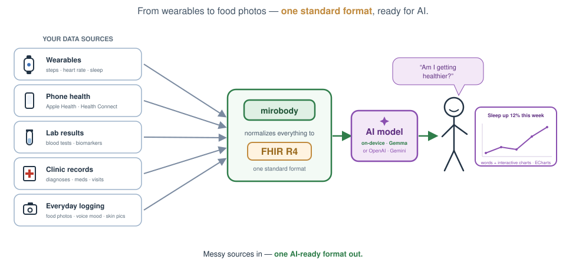

<div align="center">

# mirobody-on-device

**mirobody 的本地优先手机运行时：采集、标准化、保存并解释你自己的健康数据。**

**[English](README.md)** · **中文**

[](LICENSE)
[](CMakeLists.txt)
[](https://github.com/thetahealth/mirobody-on-device/actions/workflows/ci.yml)
[](#宿主应用)

**[mirobody 服务端](https://github.com/thetahealth/mirobody)** · **[文档](https://docs.mirobody.ai/)** · **[mirobody-web](https://github.com/thetahealth/mirobody-web)**

</div>

---

## 为什么有这个仓库

健康数据会在手机上汇合：Apple Health、Health Connect、华为运动健康、蓝牙设备，以及体检报告和用户导入的文件。手机也是最适合让私人健康记录和小型模型一起工作的地方，因为很多场景根本不需要网络往返。

`mirobody-on-device` 包含原生运行时，以及 Android、iOS 和鸿蒙宿主 App。鸿蒙内嵌核心；Android 和 iOS 在准备好原生依赖后也可内嵌。目标中的共用数据路径是：

```text
手机健康库 / 蓝牙 / 文件
          │
          ▼
    采集 → 字段映射 → FHIR Observation
          │                 │
          │                 └── SQLite + 应用沙盒文件
          ▼
    本地 Agent/工具或离线模型 → 回答
```

它也可以使用用户自己的模型 key，或连接 mirobody 服务端。这些通道的数据边界不同。当前各 App 的默认设置并不相同：Android 未覆盖设置时指向测试服务器；iOS 默认指向 `localhost:8080`，但默认不打包原生框架；鸿蒙使用内嵌核心。上传健康数据前请检查它连接的后端。

> **产品边界：** mirobody 帮你整理和解释自己的健康数据，不做诊断、不开处方，也不替代医生。

<p align="center">
  
</p>

## 手机端做什么

- **采集手机才能接触到的数据。** 宿主 App 提供 HealthKit、Health Connect、华为运动健康，以及支持的 GATT / IEEE-11073 设备适配器。
- **为手机读数编码。** 宿主适配器目前将支持的字段映射到 LOINC 概念和 UCUM 单位，再写成 FHIR `Observation`。主仓负责术语和设备对照表；本仓下一步要加载其版本化 device bundle。
- **内嵌核心时保存本地记录。** SQLite 保存结构化观察值，应用管理的文件保存原始文档。模型权重因平台而异，可以在应用存储或用户选择的位置。Android 和 iOS 的健康数据同步会写入当前选择的后端。
- **支持离线推理。** App 可以通过 llama.cpp 或 LiteRT-LM 运行本地模型；内嵌 Agent 可以用 MCP 风格工具查询本地记录。让每个 App 的离线模型都能调用这些工具仍在开发中。
- **本地核心支持 BYOK。** 云端回合中的消息、健康上下文和工具结果可能发给模型厂商。数据存在本地不等于推理一定在本地。
- **共用原生边界。** Android 集成 JNI，iOS 可链接 XCFramework，鸿蒙使用 NAPI。公开 C ABI 在 [`src/mirobody.h`](src/mirobody.h)；Android 和 iOS 的大多数 App 操作目前仍通过回环兼容入口。

<p align="center">
  
</p>

## 与主仓的分工

| 职责 | 仓库 |
|---|---|
| 账号、互助圈、多用户访问、Postgres、对象存储和云厂商数据采集 | [mirobody](https://github.com/thetahealth/mirobody) |
| 术语构建、LOINC / UCUM / ICPC-3 数据和设备对照表 | [mirobody](https://github.com/thetahealth/mirobody) |
| API 契约、SSE 事件、能力文档和服务端部署 | [mirobody](https://github.com/thetahealth/mirobody) |
| 共用 Web 界面 | [mirobody-web](https://github.com/thetahealth/mirobody-web) |
| 手机健康库、传感器、本地记录、端侧模型和 C ABI | **本仓库** |

只需要服务端的功能放在主仓。需要手机权限、传感器、应用沙盒或离线执行的功能放在本仓。目前 App 可以连接配置的服务端并写入支持的 FHIR Observation；消费主仓 device bundle、共用 FHIR Bundle 导入导出仍是待完成的集成。

## 隐私通道

数据保存位置和模型去向是两个独立概念。下表描述选择某个通道后的数据流，并不表示三个 App 的首次启动默认值相同：

| 通道 | 模型去向 | 记录去向 |
|---|---|---|
| **端侧** | 手机本地 | 选择内嵌核心作为后端时在手机 SQLite 和应用沙盒 |
| **BYOK** | 用户选择的模型厂商 | 记录位置取决于所选后端；该回合包含的消息、健康上下文和工具结果会发给厂商 |
| **mirobody 服务端** | 服务端配置的模型 | 健康上传和聊天发往自托管或托管的那台服务器 |

提交的开发配置使用 `127.0.0.1`，Android 和 iOS 内嵌桥接对监听地址强制回环，即使配置指定了局域网地址；独立开发进程当前允许通过 `HTTP_HOST` 显式覆盖。回环绑定本身并不能鉴别同一手机上的其他 App，每次启动鉴权仍是待完成的安全改进。完整的数据流见[隐私分级](docs/privacy-tiers.md)，安全假设和漏洞报告见 [SECURITY.md](SECURITY.md)。

## 在桌面运行核心

桌面构建是手机核心的开发工具，可以不接手机运行标准化器、查看工具和执行测试：

```sh
# macOS；Linux 依赖见 docs/BUILDING.md
brew install cmake ninja pkg-config libwebsockets openssl@3 rapidjson yaml-cpp \
             sqlite jpeg-turbo libpng libtiff webp catch2

git clone https://github.com/thetahealth/mirobody-on-device.git
cd mirobody-on-device
./build.sh
build/tests/mirobody_tests
build/fhir normalize "5.62 mmol/L" "72 bpm"
build/mcp list
```

这些命令只检查核心，不会下载模型，也不会运行完整的手机体验。运行 `build/mirobody` 可以启动回环入口。它把 `config.example.yml` 当模板，存在本地 `config.yml` 时优先读取；不要提交带凭据的配置文件。

想在桌面上体验最接近手机的配置，可以运行：

```sh
./build.sh mobile
```

这个配置不包含 HTTP 入口，使用的是鸿蒙原生模块所需的库形态。

## 从哪里开始贡献

| 目标 | 先看 | 最先能验证什么 |
|---|---|---|
| 核心标准化或存储 | [构建指南](docs/BUILDING.md)、`src/fhir/`、`tests/` | 桌面核心和测试 |
| Android 或 iOS 宿主 | [Android 指南](android/README.md)或 [iOS 指南](ios/README.md) | 不带原生 sysroot 时可先构建纯客户端；内嵌核心需要交叉编译依赖 |
| 鸿蒙原生路径 | [鸿蒙指南](harmony/README.md) | 准备好原生 sysroot 后验证 NAPI 路径 |
| 共用 WebView UI | [mirobody-web](https://github.com/thetahealth/mirobody-web)、[架构](docs/architecture.md) | 仍在规划集成；当前 App UI 为原生实现 |

仓库不打包模型权重。

## 宿主应用

| 宿主 | UI 与原生边界 | 当前接入方式 |
|---|---|---|
| Android | Kotlin / Compose + JNI | 有原生依赖时可内嵌回环核心；否则是远程客户端。目标是直接 C ABI。 |
| iOS | SwiftUI + 可选 XCFramework | 仓库中的工程默认是远程客户端。自行构建并接入 XCFramework 后可启用回环核心，直接调用正在扩展。 |
| 鸿蒙 | ArkUI / ArkTS + NAPI | 构建好原生依赖后，内嵌不带 HTTP 入口的手机 profile。 |

各 App 的构建和签名说明见 [android/README.md](android/README.md)、[ios/README.md](ios/README.md) 和 [harmony/README.md](harmony/README.md)。跨平台形态见 [docs/architecture.md](docs/architecture.md)。

## 为什么是 C++17

共享核心要求 **C++17**。这是一个务实的端侧平台基线：Android NDK 和 Apple Clang/libc++ 都有成熟的 C++17 路径；C++17 也让我们可以删除旧的 `optional` 兼容层，直接使用标准库。这里暂不要求 C++20，因为鸿蒙交叉工具链以及三个独立 App 的发布链都属于可移植性边界。

实现使用 C++17，但宿主看到的仍然是 C ABI。C ABI 的语义只追加、不原地改变：需要新能力时增加函数或版本化字段，不改变已有函数的含义。

## 目录结构

```text
src/                  共用 C++17 核心
  mirobody.h          面向宿主集成的公开 C ABI
  platform/           C ABI 实现和平台桥接
  chat/ llm/ mcp/     Agent 循环、模型客户端、本地工具注册表
  fhir/ indicator/    FHIR 记录和术语解析
  health/             手机数据写入 FHIR Observation
  database/ storage/  SQLite 和应用沙盒文件
  server/             开发配置中的回环入口
res/                  Agent、工具、SQLite schema 和运行时数据
android/ ios/ harmony/ 宿主 App 和原生桥接
tests/                C++ 单元测试
cli/                  开发期检查工具
tools/                文档和 ABI 检查脚本
docs/                 架构、构建、隐私和模型文档
```

## 项目状态

本仓原来是早期 mirobody v2 服务端的完整 C++ 移植。2026 年 9 月起，它收窄为手机运行时。服务端数据库、对象存储、Redis、云厂商连接器、托管记忆服务、桌面客户端和 Electron 壳保存在 [`v2-full-2026-08`](https://github.com/thetahealth/mirobody-on-device/tree/v2-full-2026-08) tag 和 `archive/v2-full` 分支中。

当前按以下顺序推进：

1. **完成本地运行时边界。** Android 和 iOS 从回环兼容入口迁移到与鸿蒙相同的直接 C ABI；HTTP 入口变成明确的开发可选模块。
2. **共用契约。** 对齐主仓 API、SSE 事件名和能力文档；原生功能通过小型宿主桥接提供。
3. **共用词表。** 使用主仓发布的版本化 device bundle，不再维护第二套设备词表。
4. **共用记录格式。** 使用主仓 FHIR Bundle 导入导出，让手机备份可以进入自托管 mirobody。

这些是集成里程碑，不代表所有通道已经完成。当前改动见 [CHANGELOG.md](CHANGELOG.md)。

## 参与贡献

先读 [CONTRIBUTING.md](CONTRIBUTING.md)。提交 PR 前运行 CI 的同一组检查：

```sh
./build.sh
build/tests/mirobody_tests
./build.sh mobile
python3 tools/check_doc_links.py
python3 tools/check_exports.py
```

如果改动涉及 Android、iOS、鸿蒙、`src/platform/` 或 C ABI，而你无法构建对应宿主，请在 PR 中说明，不要把桌面构建写成手机验证。

最有价值的问题报告是手机健康库字段被错误编码：LOINC、UCUM 单位错了，或根本没有编码。不要附带真实健康数据、凭据，或包含读数的日志。

→ [CONTRIBUTING.md](CONTRIBUTING.md) · [AGENTS.md](AGENTS.md) · [SECURITY.md](SECURITY.md) · [行为准则](CODE_OF_CONDUCT.md) · [CHANGELOG.md](CHANGELOG.md)

## 文档

- [架构](docs/architecture.md)：核心、宿主桥接、构建 profile 和数据流。
- [构建](docs/BUILDING.md)：桌面构建、手机 profile、sysroot 和 App 工具链。
- [隐私分级](docs/privacy-tiers.md)：各通道可以把什么数据发出手机。
- [端侧 LLM](docs/on-device-llm.md)：运行时、格式、量化和实测数据。
- [Markdown 契约](docs/markdown.md)：各客户端需要支持的渲染能力。
- [颜色和字体](docs/colors-and-fonts.md)：共用视觉 token。
- [文档索引](docs/README.md)：每份文档负责什么。

服务端 API 和术语归 [mirobody](https://github.com/thetahealth/mirobody) 及 [docs.mirobody.ai](https://docs.mirobody.ai/) 所有。本仓遵循这些契约，不复制另一份。

<div align="center">

Apache 2.0 · © 2026 [Theta Health](https://thetahealth.ai)

</div>
